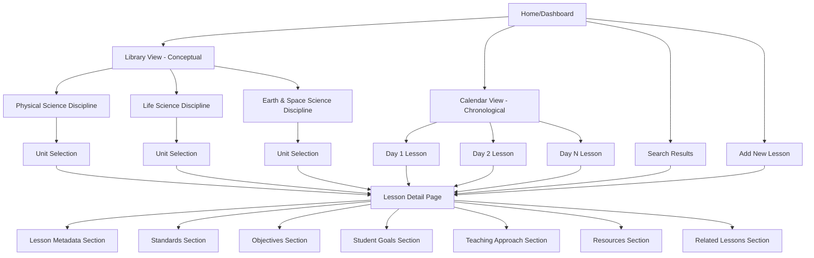
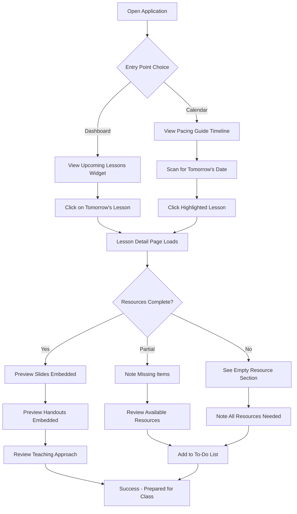
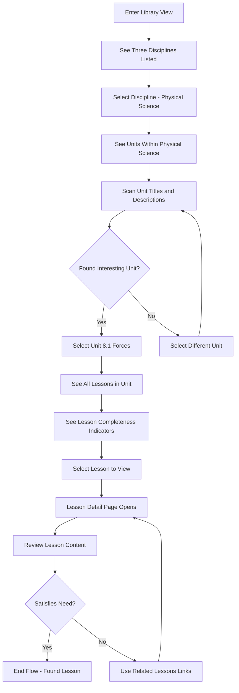
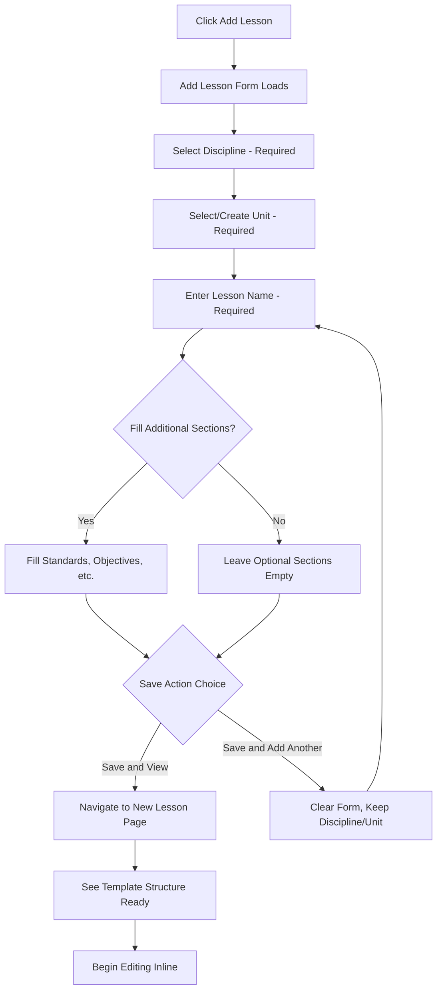
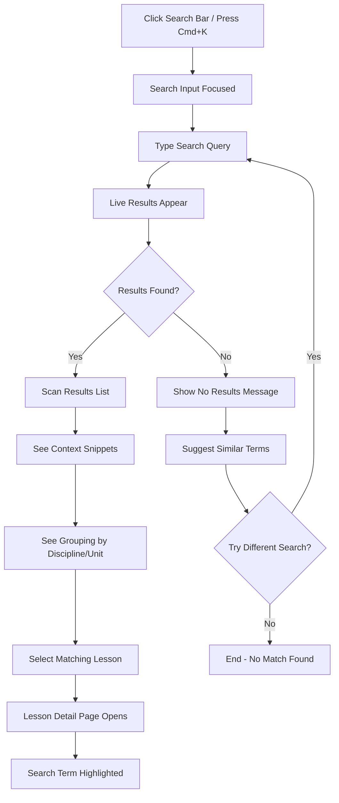

# Open Science Education Lesson Repository UI/UX Specification

This document defines the user experience goals, information architecture, user flows, and visual design specifications for Open Science Education Lesson Repository's user interface. It serves as the foundation for visual design and frontend development, ensuring a cohesive and user-centered experience.

## Introduction

### Overall UX Goals & Principles

#### Target User Personas

**Primary User: Early-Career Science Teacher**

- **Profile**: 1-3 years teaching experience, teaches multiple science disciplines (Physical, Life, Earth & Space Science)
- **Context**: Limited planning time between classes, needs quick access to teaching materials
- **Goals**: Reduce lesson planning time, eliminate preparation surprises, find complete materials in <30 seconds
- **Pain Points**: Overwhelmed by OpenSciEd material volume, scattered resources across platforms, inconsistent preparation leading to classroom stress
- **Technical Comfort**: Comfortable with web applications, uses Google Workspace, expects modern responsive interfaces
- **Planning Behavior**: Plans 1-3 lessons ahead, reviews materials day-before or morning-of teaching, values consistency and predictability

#### Usability Goals

1. **Speed of Access**: User can locate complete lesson materials within 30 seconds from application launch
2. **Cognitive Load Reduction**: Consistent lesson page structure eliminates relearning navigation for each lesson
3. **Minimal Clicks**: Primary workflows (browse to lesson, search for lesson, view resources) require ≤3 clicks
4. **Obvious Next Actions**: User never needs to guess how to proceed or where to find information
5. **Confident Planning**: User can assess lesson completeness at a glance and trust they have everything needed
6. **Interruption Recovery**: User can leave and return to planning session without losing context or position

#### Design Principles

1. **Reference Library Over Software Application** - Design should feel like browsing a well-organized bookshelf, not operating a complex system. Visual hierarchy, clear labels, and self-evident navigation patterns take precedence over trendy UI patterns.

2. **Consistency Creates Speed** - Every lesson page follows identical structure. Scanning patterns learned once apply everywhere. Predictability reduces cognitive load and builds user confidence.

3. **Show Progress, Don't Hide Incompleteness** - Empty sections are visible with clear "Not yet added" indicators. Users should see what's complete and what needs work at a glance, encouraging incremental progress without shame.

4. **Dual Mental Models, Seamless Switching** - Support both conceptual thinking (disciplines/units/lessons) and chronological thinking (Day 1, Day 2...) without forcing either model. Context preservation when switching ensures users never get lost.

5. **Professional Calm Over Consumer Excitement** - This is a professional planning tool, not a consumer app. Visual design conveys organization, reliability, and focus. Avoid playful aesthetics, aggressive colors, or distracting animations.

### Change Log

| Date       | Version | Description                                      | Author            |
| ---------- | ------- | ------------------------------------------------ | ----------------- |
| 2025-10-01 | 1.0     | Initial Front-End Specification created from PRD | UX Expert (Sally) |

---

## Information Architecture (IA)

### Site Map / Screen Inventory

### Navigation Structure

**Primary Navigation:**
Top-level navigation bar provides access to core application modes:

- **Home** (Dashboard with overview and recent lessons)
- **Library** (Conceptual navigation: Discipline → Unit → Lesson)
- **Calendar** (Chronological navigation: Pacing guide sequence)
- **Search** (Global search accessible from anywhere)
- **Add Lesson** (Quick action always available)

Visual indicator shows currently active navigation mode (Library vs. Calendar) when viewing lesson detail pages.

**Secondary Navigation:**
Within lesson detail pages:

- **Breadcrumb trail** showing current location in conceptual hierarchy (e.g., Physical Science > Unit 8.1 Forces > Lesson 1)
- **Sequential navigation** with Previous/Next buttons for moving through lesson sequence
- **Related Lessons** sidebar showing prerequisites, follow-ups, and parallel lessons in other disciplines
- **Quick jump to Unit** and **Quick jump to Discipline** links in breadcrumb

**Breadcrumb Strategy:**
Breadcrumbs appear below primary navigation on all screens except Home/Dashboard:

- Format: `Home > [Mode] > [Discipline] > [Unit] > [Lesson]`
- Each segment is clickable for instant navigation
- Current page is not clickable but visually distinct
- Breadcrumbs update dynamically when switching between Library and Calendar modes (maintaining lesson context but showing different hierarchy)

---

## User Flows

### Flow 1: Find Tomorrow's Lesson Materials (Primary Use Case)

**User Goal:** Teacher needs to review complete materials for tomorrow's lesson to prepare for class

**Entry Points:**

- Home/Dashboard showing "Upcoming Lessons" section
- Calendar View showing chronological sequence with current date highlighted

**Success Criteria:**

- User locates correct lesson within 30 seconds
- User can preview all resources (slides, handouts, procedure documents) without downloading
- User can confirm lesson completeness at a glance

#### Flow Diagram

#### Edge Cases & Error Handling:

- **No upcoming lessons found**: Dashboard shows "No upcoming lessons scheduled" with prompt to add lessons or update pacing guide
- **File viewer fails to load**: Fallback to download link with clear error message "Unable to preview file. Download to view."
- **Lesson marked as "Needs Review"**: Visual warning indicator on lesson card with explanation of what needs updating
- **Pacing guide not set**: Calendar view shows message "Set up your pacing guide to see chronological view" with link to configuration
- **Slow file loading (>2 seconds)**: Show loading spinner with progress indicator and estimated time remaining

**Notes:** This is the highest-priority flow and should be optimized for speed. Dashboard widget should load lesson data in <1 second to enable quick access.

---

### Flow 2: Browse and Discover Lesson by Concept (Exploratory Use Case)

**User Goal:** Teacher wants to explore what lessons are available within a specific unit or discipline without knowing exact lesson name

**Entry Points:**

- Home/Dashboard "Library View" button
- Primary navigation "Library" link

**Success Criteria:**

- User can browse entire content hierarchy in 3 clicks: Discipline → Unit → Lesson
- Visual indicators show content completeness at each level
- User understands lesson relationships and prerequisites while browsing

#### Flow Diagram

#### Edge Cases & Error Handling:

- **Empty discipline**: Show "No units yet in this discipline" with "Add Unit" button
- **Empty unit**: Show "No lessons yet in this unit" with "Add Lesson" button
- **Partially complete lesson**: Completeness indicator shows percentage (e.g., "60% complete - missing resources")
- **Deep nesting confusion**: Breadcrumb always shows current position; "Back to Unit" link always visible

**Notes:** Three-panel layout (Discipline | Unit | Lesson) provides spatial consistency and reduces cognitive load. Users should never need to use browser back button.

---

### Flow 3: Add New Lesson to Repository

**User Goal:** Teacher wants to create a new lesson page with template structure ready for content population

**Entry Points:**

- Primary navigation "Add Lesson" button (accessible from anywhere)
- Empty state prompts in Library View or Calendar View
- Home/Dashboard quick action button

**Success Criteria:**

- User can create basic lesson structure in <2 minutes
- Template sections are pre-populated with clear guidance
- User can immediately begin adding content after creation

#### Flow Diagram

#### Edge Cases & Error Handling:

- **Duplicate lesson name**: Warning shown "Lesson with this name exists in this unit. Continue anyway?" with options to rename or view existing
- **Unsaved form data**: If user navigates away, prompt "Lesson not saved. Save now or discard?"
- **Unit doesn't exist**: Inline unit creation option appears "Create new unit: [Name]" within form
- **Network error during save**: Form data preserved in browser, retry prompt shown with manual save option

**Notes:** Form should support rapid entry for batch lesson creation (multiple lessons in same unit). "Save and Add Another" preserves discipline/unit selection to minimize repetitive typing.

---

### Flow 4: Search for Lesson by Keyword or Standard

**User Goal:** Teacher needs to find a lesson related to a specific topic or educational standard without browsing hierarchy

**Entry Points:**

- Global search bar in primary navigation (always visible)
- Home/Dashboard search widget
- Keyboard shortcut (Cmd/Ctrl + K)

**Success Criteria:**

- Search results appear in <1 second
- Results show relevant context (where keyword appears: title, standard, objective)
- User can distinguish between multiple matching lessons quickly

#### Flow Diagram

#### Edge Cases & Error Handling:

- **No results**: Show "No lessons match '[query]'. Try searching for [suggested terms] or browse Library."
- **Too many results (>20)**: Show first 20 with "Show more results" option and filtering by discipline
- **Typo in query**: Offer "Did you mean: [corrected term]?" suggestion
- **Search while offline**: Show cached recent lessons with message "Search unavailable offline. Showing recent lessons."
- **Special characters in query**: Handle gracefully, escape or sanitize without error message

**Notes:** Search should support partial matches, common misspellings, and educational standard codes (e.g., "NGSS MS-PS2-2"). Results should prioritize exact matches in lesson titles over body content matches.

---

## Wireframes & Mockups

**Primary Design Files:** Design files will be created in Figma (or user's preferred tool) after specification approval. This section will link to Figma project containing all screen mockups and interactive prototypes.

### Key Screen Layouts

#### Screen 1: Home/Dashboard

**Purpose:** Provide quick access to both navigation modes, show upcoming lessons, enable search, and display content status overview

**Key Elements:**

- Welcome header with user context (optional: "Good morning" or current date)
- Navigation mode selector (large buttons for Library View and Calendar View)
- Upcoming Lessons widget showing next 3-5 lessons in pacing guide sequence with completeness indicators
- Recently accessed lessons list (last 5 viewed) for quick return
- Global search bar prominently placed at top
- Content status summary (e.g., "8 of 12 lessons complete in Unit 8.1")
- Quick action: "Add New Lesson" button

**Interaction Notes:**

- Upcoming Lessons cards are clickable and navigate directly to lesson detail page
- Navigation mode buttons have visual distinction (not just text labels)
- Recently accessed lessons show last viewed timestamp
- Dashboard loads in <2 seconds with all widgets visible

**Design File Reference:** [Figma: Dashboard Screen - to be created]

---

#### Screen 2: Library View (Conceptual Navigation)

**Purpose:** Enable browsing by discipline, unit, and lesson hierarchy with visual indicators of content completeness

**Key Elements:**

- Three-column layout: Discipline List (left 20%) | Unit List (middle 30%) | Lesson List (right 50%)
- Discipline column: 3 disciplines with icons and lesson count totals
- Unit column: Units for selected discipline with descriptions and completeness percentages
- Lesson column: Lessons for selected unit with titles, sequence numbers, and status icons
- Breadcrumb navigation at top
- Search bar in header
- "Add Lesson" button always visible

**Interaction Notes:**

- Selecting discipline highlights it and populates unit column
- Selecting unit highlights it and populates lesson column
- Selecting lesson navigates to Lesson Detail Page
- Empty states show encouraging messages with "Add" prompts
- Columns scroll independently if content exceeds viewport height

**Design File Reference:** [Figma: Library View - to be created]

---

#### Screen 3: Calendar View (Chronological Navigation)

**Purpose:** Display lessons in teaching sequence order with date context and quick access to upcoming lessons

**Key Elements:**

- Timeline or calendar grid showing lesson sequence (Day 1, Day 2, etc.)
- Current date or teaching position highlighted
- Each lesson shows: sequence number, lesson title, discipline indicator, completeness icon
- Optional: Week/month grouping for long sequences
- Navigation controls: Today, Previous Week, Next Week
- Breadcrumb showing current position in calendar
- Quick jump to date selector

**Interaction Notes:**

- Clicking any lesson card navigates to Lesson Detail Page
- Current date position is auto-scrolled into view on page load
- Lesson cards show visual distinction for status: upcoming (blue), in progress (yellow), completed (green), needs review (red)
- Drag-and-drop for lesson reordering is NOT supported in MVP (chronological order is fixed by pacing guide)

**Design File Reference:** [Figma: Calendar View - to be created]

---

#### Screen 4: Lesson Detail Page

**Purpose:** Display all lesson information in consistent template structure with inline editing and resource preview

**Key Elements:**

- Page header: Lesson title, breadcrumb, mode indicator (Library/Calendar), status badge
- Navigation controls: Previous Lesson, Next Lesson, Back to [Unit/Calendar]
- Content sections in fixed order:
  1. Lesson Overview (name, description, sequence info)
  2. Educational Standards (NGSS or state standards)
  3. Learning Objectives (instructor-facing)
  4. Student-Friendly Goals ("We are learning to..." statements)
  5. Teaching Approach / Methodology (instructional notes)
  6. Resources (embedded file viewers with download links)
  7. Related Lessons (prerequisites, follow-ups, parallel lessons)
- Inline editing: Click any section to edit, auto-save on blur
- "Edit" icon appears on hover for each section
- Empty sections show "Not yet added - Click to add content"

**Interaction Notes:**

- All sections are collapsible but default to expanded on first view
- Resources section shows embedded viewers for PDF/PPTX/DOCX files
- File viewer loading shows progress bar
- Related Lessons are hyperlinks that navigate directly to those lesson pages
- Lesson status can be changed via dropdown in header

**Design File Reference:** [Figma: Lesson Detail Page - to be created]

---

#### Screen 5: Search Results Page

**Purpose:** Display search results with context and enable quick navigation to matching lessons

**Key Elements:**

- Search query displayed at top with edit option
- Results count (e.g., "5 results for 'forces'")
- Results grouped by Discipline/Unit for context
- Each result shows:
  - Lesson title (hyperlink)
  - Discipline and Unit breadcrumb
  - Context snippet showing where search term appears (with term highlighted)
  - Completeness indicator
- Filters: By discipline, by content completeness, by status
- Sort options: Relevance (default), Sequence, Recently Updated

**Interaction Notes:**

- Clicking lesson title navigates to Lesson Detail Page
- Search term is pre-highlighted on destination page
- Filters apply instantly without page reload
- Empty result state shows "No matches found. Try [suggestions] or browse Library."
- Recent searches are stored for quick re-search

**Design File Reference:** [Figma: Search Results - to be created]

---

#### Screen 6: Add New Lesson Form

**Purpose:** Create new lesson with minimal friction and template structure pre-populated

**Key Elements:**

- Form title: "Add New Lesson"
- Required fields (marked with asterisk):
  - Discipline (dropdown)
  - Unit (dropdown with "Create new unit" option)
  - Lesson Name (text input)
- Optional fields:
  - Lesson Description (textarea)
  - Sequence Position (number input - auto-calculated by default)
- Action buttons:
  - "Save and View Lesson" (primary button)
  - "Save and Add Another" (secondary button)
  - "Cancel" (tertiary link)
- Inline validation messages
- Progress indicator if creating new unit simultaneously

**Interaction Notes:**

- Discipline and Unit dropdowns show existing content counts (e.g., "Physical Science (8 lessons)")
- "Create new unit" shows inline form within Unit dropdown
- Form validates on submit, not on field change (to avoid annoying interruptions)
- "Save and Add Another" keeps Discipline/Unit selected for rapid entry
- Cancel prompts if any fields have content

**Design File Reference:** [Figma: Add Lesson Form - to be created]

---

## Component Library / Design System

**Design System Approach:**
Recommend using **Material Design 3** (Material UI) or **Chakra UI** as foundation for component library. Both provide:

- Pre-built accessible components aligned with WCAG AA standards
- Consistent design language with professional aesthetic suitable for educational context
- Robust documentation and community support for faster development
- Built-in responsive behavior for desktop/tablet support
- Customizable theming for brand alignment

**Custom Component Needs:**

- Lesson Card Component (with status indicators, completeness badges)
- Three-Column Navigation Layout (for Library View)
- Embedded File Viewer Component (wrapping PDF.js or similar)
- Breadcrumb with mode indicator
- Collapsible Section Component (for lesson detail page)

### Core Components

#### Component 1: Lesson Card

**Purpose:** Display lesson summary information in browsable lists (Library View, Calendar View, Search Results)

**Variants:**

- List view (compact, for lesson lists within unit)
- Card view (expanded, for calendar timeline or search results)
- Thumbnail view (minimal, for related lessons sidebar)

**States:**

- Default (no special status)
- Upcoming (lesson in near future, blue accent)
- In Progress (lesson currently being taught, yellow accent)
- Completed (lesson finished, green accent)
- Needs Review (lesson flagged for updates, red accent)
- Hover (shows additional actions: Edit, View, Duplicate)
- Selected (when active in multi-panel navigation)

**Usage Guidelines:**

- Always include lesson title, discipline indicator, and completeness percentage
- Status badges use color + icon for accessibility
- Click anywhere on card navigates to lesson detail page
- Secondary actions (Edit, Duplicate) appear on hover to reduce visual clutter

---

#### Component 2: File Viewer Embed

**Purpose:** Display PDF, PPTX, and DOCX files inline within lesson resource section without requiring downloads

**Variants:**

- PDF viewer (using PDF.js or browser native)
- PPTX viewer (using Office Online Viewer or similar)
- DOCX viewer (using Google Docs Viewer or similar)
- Fallback viewer (for unsupported formats, shows metadata + download link)

**States:**

- Loading (progress bar or skeleton screen)
- Loaded (file displayed with controls: zoom, page navigation, download)
- Error (message with download link)
- Offline (cached preview if available, or download-only mode)

**Usage Guidelines:**

- Viewer height defaults to 500px, expandable to fullscreen
- Download button always visible even when preview works
- Error messages are actionable ("Unable to preview. Download file" with download button)
- Loading timeout after 10 seconds triggers fallback to download-only mode

---

#### Component 3: Collapsible Section

**Purpose:** Organize lesson detail page content into manageable, scannable sections that can be expanded/collapsed

**Variants:**

- Content-populated (section has content, shows preview text)
- Empty (section has no content, shows "Not yet added" message)
- Editable (section in edit mode with inline form)

**States:**

- Collapsed (shows section title + short preview)
- Expanded (shows full section content)
- Editing (section content replaced with inline editor)
- Saving (shows save indicator)

**Usage Guidelines:**

- All sections default to expanded on first visit to lesson page
- User preference (collapsed/expanded) persists per section across page visits
- Edit icon appears on hover over section header
- Click anywhere on header toggles collapse/expand
- Empty sections encourage content addition with clear call-to-action

---

#### Component 4: Breadcrumb Navigation with Mode Indicator

**Purpose:** Show current location in site hierarchy and provide quick navigation up the hierarchy, with clear indication of Library vs Calendar mode

**Variants:**

- Library mode breadcrumb (shows: Home > Library > Discipline > Unit > Lesson)
- Calendar mode breadcrumb (shows: Home > Calendar > [Date/Sequence] > Lesson)

**States:**

- Default (all segments clickable except current page)
- Current page (last segment, not clickable, visually distinct)
- Hover (segment shows underline or color change)

**Usage Guidelines:**

- Mode indicator (Library or Calendar badge) appears before lesson name segment
- Each segment is separated by chevron (>) or slash (/)
- Breadcrumb truncates intelligently on narrow viewports (keeps first and last segments, collapses middle with "...")
- Clicking any segment navigates instantly without confirmation

---

#### Component 5: Status Badge

**Purpose:** Indicate lesson status (upcoming, in progress, completed, needs review) consistently across all views

**Variants:**

- Dot indicator (minimal, for compact lists)
- Chip/badge (standard, includes icon + text label)
- Banner (full-width, for lesson detail page header)

**States:**

- Upcoming (blue with clock icon)
- In Progress (yellow with progress icon)
- Completed (green with checkmark icon)
- Needs Review (red with warning icon)
- No status (gray, or hidden if default)

**Usage Guidelines:**

- Use dot indicator in space-constrained views
- Use chip/badge in normal card views
- Use banner in lesson detail header for high visibility
- Hover shows tooltip with status change date/reason
- Clicking badge in detail view allows status change via dropdown

---

## Branding & Style Guide

### Visual Identity

**Brand Guidelines:** [To be linked - professional educational aesthetic, clean and modern]

The visual identity should convey:

- **Professionalism**: This is a serious planning tool, not a playful app
- **Clarity**: Information hierarchy is obvious, nothing is hidden or ambiguous
- **Calm**: Visual design reduces stress rather than adding to it
- **Organization**: Strong sense of structure and order
- **Trust**: Reliable, stable, predictable interface that won't surprise users

### Color Palette

| Color Type | Hex Code                                        | Usage                                                                      |
| ---------- | ----------------------------------------------- | -------------------------------------------------------------------------- |
| Primary    | #1976D2                                         | Interactive elements, primary actions, hyperlinks, active navigation items |
| Secondary  | #424242                                         | Secondary text, disabled states, borders, inactive elements                |
| Accent     | #FF6F00                                         | Highlights, urgent actions, attention-drawing elements (use sparingly)     |
| Success    | #388E3C                                         | Completed status, positive feedback, success messages                      |
| Warning    | #F57C00                                         | Needs review status, cautions, important notices requiring attention       |
| Error      | #D32F2F                                         | Errors, destructive actions, critical alerts                               |
| Neutral    | #FAFAFA (bg), #212121 (text), #E0E0E0 (borders) | Background surfaces, body text, dividers, input borders                    |

**Color Usage Notes:**

- Maintain minimum 4.5:1 contrast ratio for normal text (WCAG AA)
- Maintain minimum 3:1 contrast ratio for large text and UI components
- Use neutral colors for majority of interface to reduce eye strain
- Reserve accent color for truly important actions (don't overuse)
- Status colors (success, warning, error) should always be paired with icons for colorblind accessibility

### Typography

#### Font Families

- **Primary:** Inter, system-ui, -apple-system, BlinkMacSystemFont, "Segoe UI", Roboto, "Helvetica Neue", Arial, sans-serif
- **Secondary:** (same as primary - single font family for simplicity)
- **Monospace:** 'Courier New', Courier, monospace (for code or technical content, if needed)

**Font Selection Rationale:**
Inter is selected for:

- Excellent readability at all sizes
- Professional, neutral aesthetic
- Wide Unicode support
- Open source and free to use
- Optimized for digital interfaces

#### Type Scale

| Element | Size | Weight          | Line Height  |
| ------- | ---- | --------------- | ------------ |
| H1      | 32px | 700 (Bold)      | 1.2 (38.4px) |
| H2      | 24px | 600 (Semi-Bold) | 1.3 (31.2px) |
| H3      | 20px | 600 (Semi-Bold) | 1.4 (28px)   |
| Body    | 16px | 400 (Regular)   | 1.5 (24px)   |
| Small   | 14px | 400 (Regular)   | 1.4 (19.6px) |

**Typography Usage Notes:**

- Use H1 only once per page (page title)
- Maintain clear heading hierarchy (don't skip levels)
- Body text should be comfortable for extended reading
- Line length (measure) should not exceed 75 characters for readability
- Increase line height for longer text blocks

### Iconography

**Icon Library:** Material Symbols (Material Design Icons)

**Usage Guidelines:**

- Use outlined style for consistency (not filled or rounded variants)
- Standard icon size: 24px (scale to 20px for compact views, 32px for prominent actions)
- Always pair status icons with color (don't rely on color alone)
- Provide tooltips or labels for icon-only buttons
- Limit icon usage to reduce visual clutter (not every action needs an icon)

**Core Icons Needed:**

- Home (home/dashboard)
- Library (conceptual navigation)
- Calendar (chronological navigation)
- Search (global search)
- Add (create new lesson)
- Edit (inline editing)
- Expand/Collapse (section toggles)
- Previous/Next (lesson navigation)
- Download (file actions)
- Status icons: Clock (upcoming), Progress (in progress), Check (complete), Warning (needs review)

### Spacing & Layout

**Grid System:** 8px base unit grid for all spacing and sizing decisions

**Spacing Scale:**

- `xs`: 4px (tight spacing within small components)
- `sm`: 8px (standard spacing between related elements)
- `md`: 16px (spacing between component groups)
- `lg`: 24px (spacing between major sections)
- `xl`: 32px (page margins and major layout gaps)
- `2xl`: 48px (extra-large section breaks)

**Layout Guidelines:**

- Container max-width: 1280px (prevents excessive line length on large screens)
- Page margins: 24px on mobile/tablet, 32px on desktop
- Content columns: Use 12-column grid for flexible layouts
- Consistent component spacing creates visual rhythm and reduces cognitive load

---

## Accessibility Requirements

### Compliance Target

**Standard:** WCAG 2.1 Level AA

This ensures the application is accessible to users with:

- Visual impairments (low vision, color blindness)
- Motor impairments (keyboard-only navigation)
- Cognitive impairments (clear structure and predictable patterns)

### Key Requirements

**Visual:**

- Color contrast ratios: Minimum 4.5:1 for normal text, 3:1 for large text (18pt+) and UI components
- Focus indicators: Visible focus outline (2px solid, high contrast color) on all interactive elements
- Text sizing: Support browser zoom to 200% without horizontal scrolling or loss of functionality

**Interaction:**

- Keyboard navigation: All features accessible via keyboard (Tab, Shift+Tab, Enter, Space, Arrow keys)
- Screen reader support: Semantic HTML, ARIA labels where needed, skip navigation links, meaningful link text
- Touch targets: Minimum 44x44px for all interactive elements to support touch input on tablets

**Content:**

- Alternative text: All informational images include descriptive alt text; decorative images use alt=""
- Heading structure: Proper H1-H6 hierarchy without skipping levels, outline matches visual hierarchy
- Form labels: All inputs have associated labels, error messages linked to inputs via aria-describedby

### Testing Strategy

**Testing Phases:**

1. **Automated Testing (Continuous)**
   - Run axe DevTools or Lighthouse accessibility audit in CI/CD pipeline
   - Catch contrast issues, missing alt text, invalid ARIA usage
   - Automated tests run on every pull request

2. **Keyboard Navigation Testing (Per Feature)**
   - Manually test all workflows using keyboard only (no mouse)
   - Verify tab order is logical and focus is visible
   - Ensure all actions (open, close, edit, save) work with keyboard

3. **Screen Reader Testing (Major Releases)**
   - Test with NVDA (Windows) or VoiceOver (Mac)
   - Verify page structure, navigation landmarks, form labels
   - Ensure dynamic content updates are announced appropriately

4. **User Testing (MVP and Beyond)**
   - Recruit early-career teachers with various accessibility needs
   - Observe real usage patterns and pain points
   - Iterate based on feedback

---

## Responsiveness Strategy

### Breakpoints

| Breakpoint | Min Width | Max Width | Target Devices                            |
| ---------- | --------- | --------- | ----------------------------------------- |
| Mobile     | -         | 767px     | Smartphones (not primary target for MVP)  |
| Tablet     | 768px     | 1023px    | iPad, Android tablets, small laptops      |
| Desktop    | 1024px    | 1439px    | Standard laptops, desktop monitors        |
| Wide       | 1440px    | -         | Large desktop monitors, external displays |

**Breakpoint Strategy Notes:**

- MVP focuses on Tablet and Desktop breakpoints (mobile support is degraded, not optimized)
- Three-column Library View collapses to two columns on Tablet (Discipline/Unit combined)
- Calendar View shows fewer days per row on Tablet (3-4 days vs 7 days on Desktop)

### Adaptation Patterns

**Layout Changes:**

- Desktop: Three-column Library View, side-by-side resource viewers, multi-panel dashboards
- Tablet: Two-column layouts where possible, stacked resource viewers, single-panel focus
- Mobile (degraded): Single-column stacked layout, bottom navigation bar, simplified dashboard

**Navigation Changes:**

- Desktop: Top horizontal navigation bar with all options visible
- Tablet: Condensed horizontal navigation with icons + labels
- Mobile (degraded): Hamburger menu or bottom tab bar (not optimized in MVP)

**Content Priority:**

- Desktop: Show all lesson sections expanded by default, sidebar with related lessons always visible
- Tablet: Collapse less critical sections by default (Related Lessons, Teaching Approach), prioritize Standards and Resources
- Mobile (degraded): Progressive disclosure with only Lesson Title and Resources visible initially

**Interaction Changes:**

- Desktop: Hover states for secondary actions, tooltips on hover, inline editing on click
- Tablet: Tap interactions replace hover, tooltips on tap-hold, inline editing with larger touch targets
- Mobile (degraded): Bottom sheet for secondary actions, full-screen editing mode

---

## Animation & Micro-interactions

### Motion Principles

**Purposeful Motion Only:**

- Use animation to provide feedback, guide attention, and show relationships
- Avoid decorative or distracting animations
- Keep animations fast (100-300ms) to maintain sense of responsiveness
- Respect prefers-reduced-motion media query (disable animations for users who opt out)

**Animation Philosophy:**

- Professional, subtle, utilitarian
- Transitions should feel instant (even if they're 100ms)
- Motion should explain "what just happened" not just "look pretty"
- No bouncy, whimsical, or overly playful easing curves

### Key Animations

- **Page transitions:** Fade in new page content (200ms, ease-out) - explains context change
- **Section collapse/expand:** Smooth height animation (250ms, ease-in-out) - shows content relationship
- **Lesson card hover:** Subtle lift and shadow increase (150ms, ease-out) - indicates interactivity
- **File viewer loading:** Progress bar fill animation (indeterminate, smooth) - provides loading feedback
- **Inline edit transition:** Fade out static text, fade in editable input (150ms, ease-in-out) - mode change indication
- **Toast notifications:** Slide in from top right (200ms, ease-out), auto-dismiss after 4s with fade out (200ms, ease-in)
- **Search results appear:** Stagger items by 50ms (first result immediate, each subsequent +50ms offset) - creates sense of speed and discovery

---

## Performance Considerations

### Performance Goals

- **Page Load:** Initial page load <3 seconds on standard broadband (25 Mbps), measured via Lighthouse
- **Interaction Response:** UI feedback for user actions within 100ms (immediate perceived response)
- **Animation FPS:** Maintain 60 FPS for all animations and scrolling (smooth, no jank)

**Performance Budget:**

- JavaScript bundle: <200KB gzipped (first load)
- CSS bundle: <50KB gzipped
- Total page weight: <1MB for lesson detail page including embedded resources
- Time to Interactive: <4 seconds on desktop, <5 seconds on tablet

### Design Strategies

**Code Splitting:**

- Load file viewer libraries only when user opens resource section
- Lazy load Calendar View components when user switches to Calendar mode
- Defer loading non-critical features until after first paint

**Image Optimization:**

- Use WebP format for any UI images or icons (with fallback)
- Responsive images with srcset for different viewport sizes
- Lazy load images below fold

**Caching Strategy:**

- Aggressive caching of lesson data (serve stale while revalidate)
- Cache file viewer libraries in browser after first load
- Service worker for offline support of recently viewed lessons

**Rendering Optimization:**

- Server-side render initial page content for fast First Contentful Paint
- Virtualize long lists (lesson lists with 50+ items) using react-window or similar
- Debounce search input to avoid excessive API calls (300ms delay)

**Resource Loading:**

- Preload critical fonts and CSS for faster render
- Use resource hints (preconnect, prefetch) for file storage CDN
- Progressive enhancement: core functionality works without JavaScript, enhanced features load progressively

---

## Next Steps

### Immediate Actions

1. **Review and approve this specification** with stakeholders (user/teacher feedback session)
2. **Create visual design mockups in Figma** for all core screens (Home, Library, Calendar, Lesson Detail, Search, Add Lesson)
3. **Generate clickable prototype** for user testing and flow validation
4. **Conduct heuristic evaluation** of wireframes against usability principles and accessibility checklist
5. **Prepare design handoff package** for Architect: annotated Figma files, component specifications, interaction notes, asset exports

### Design Handoff Checklist

- [ ] All user flows documented and validated with sample user scenarios
- [ ] Component inventory complete with variants, states, and usage guidelines specified
- [ ] Accessibility requirements defined with WCAG AA compliance targets and testing strategy
- [ ] Responsive strategy clear with breakpoint specifications and adaptation patterns documented
- [ ] Brand guidelines incorporated with color palette, typography, iconography, spacing defined
- [ ] Performance goals established with measurable targets for page load, interaction, animation

---

## Checklist Results

_(This section will be populated after running UX checklist against completed specification, if checklist exists in BMad workflow)_

**Status:** Front-End Specification complete and ready for Architect review.

**Next Workflow Step:** Activate Architect agent to create technical architecture based on PRD + Front-End Spec.
