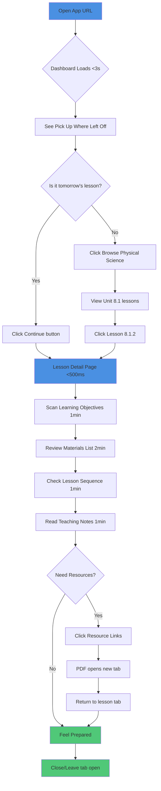
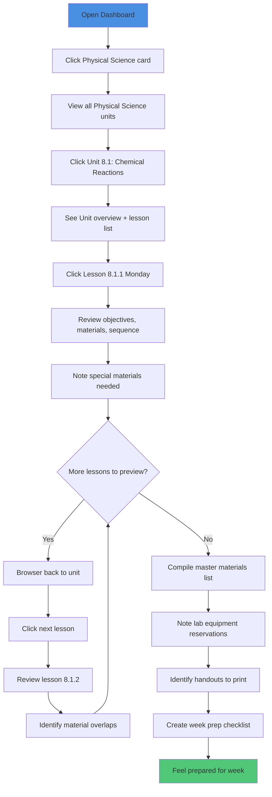
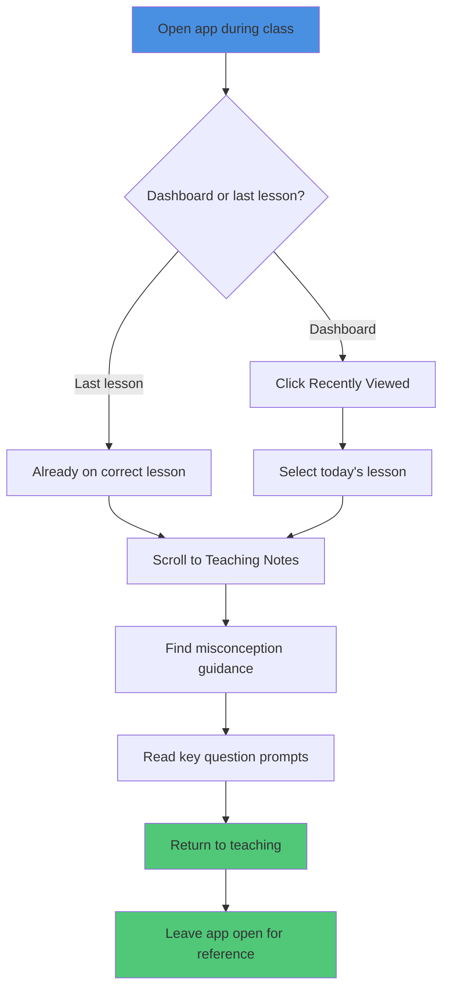
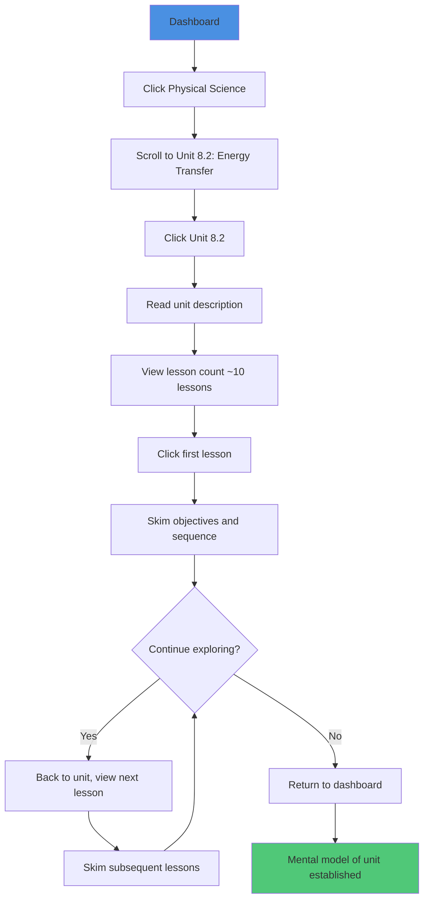
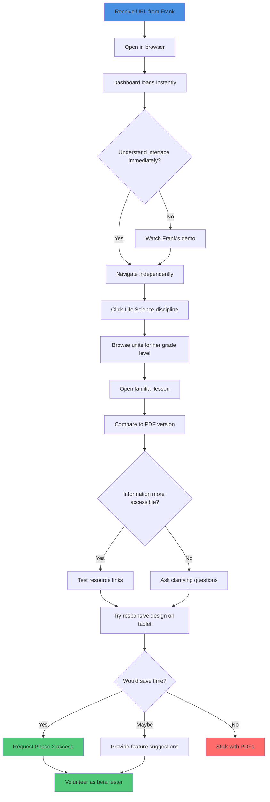

# Open-Sci-Ed-Lesson-Repository UX/UI Specification

_Generated on 2025-10-13 by Frank_

## Executive Summary

### Project Overview

**OpenSciEd Lesson Repository** is a comprehensive web application transforming the OpenSciEd middle school science curriculum from unwieldy PDFs into a structured, searchable, easily navigable digital platform. The system addresses the critical challenge faced by science teachers who waste 20-30 minutes per lesson searching through massive PDF documents to extract learning objectives, materials lists, and teaching guidance.

**Project Level**: 3 (Full product with subsystems and architectural planning)
**Primary Platform**: Web application (desktop + tablet MVP)
**Future Expansion**: Mobile applications, desktop apps, student-facing views

### Target Users

**Primary Persona: Frank** - Middle school science teacher
- **Context**: Evening lesson planning (7-10 PM) on laptop or tablet
- **Pain Point**: Spends 20-30 minutes per lesson hunting through dense PDFs in Google Drive
- **Goal**: Quick access (<10 minutes) to objectives, materials, and teaching notes
- **Success Metric**: 50% time reduction, 90%+ daily tool adoption

**Secondary Persona: Department Colleagues** (Phase 2)
- Science teachers in same school/department
- Interest in collaborative lesson planning and sharing
- Future multi-user access and custom lesson building

**Tertiary Persona: Students** (Phase 3)
- Middle school science students
- Filtered view showing only objectives and assignments
- Assignment tracking and progress monitoring

### Core Features (MVP Scope)

1. **Dashboard Landing Page**
   - **Pick Up Where You Left Off**: Quick access to last viewed lesson
   - **Recently Viewed Lessons**: Last 5 lessons for easy re-access
   - **Browse by Discipline**: Quick cards for Life, Earth & Space, Physical Science
   - **Future Feature Preview**: "My Classes" card (grayed out, "Coming Soon" label)
   - **Navigation Menu**: Hamburger menu with Users, Classes, Lessons, OpenSciEd Curriculum (future items disabled)

2. **Three-Level Hierarchical Navigation**
   - Discipline selection (Life, Earth & Space, Physical Science)
   - Unit browsing within discipline
   - Lesson detail access (3 clicks maximum from home)

3. **Comprehensive Lesson Display** (Single Page)
   - Learning objectives (WALTs)
   - Complete materials list with quantities
   - Lesson sequence and pacing
   - Teaching guidance and misconception notes
   - One-click resource access (PDFs, PowerPoints)

4. **Dark Mode Interface**
   - Default dark theme for evening use
   - WCAG 2.1 Level AA accessibility
   - Professional, minimalist aesthetic

5. **Responsive Multi-Device Support**
   - Desktop-optimized (primary)
   - Tablet-friendly (secondary)
   - Future mobile optimization

6. **Future-Ready Architecture**
   - Modular lesson sections for custom lesson builder (Phase 2)
   - Audience tagging for student/teacher views (Phase 3)
   - Authentication-ready routing structure

### Key UX Goals

1. **Zero Learning Curve**: Users navigate successfully within 60 seconds, no training needed
2. **Speed as Feature**: <3s initial load, <500ms navigation transitions
3. **Information Density Optimization**: All lesson components visible without excessive scrolling
4. **Context Preservation**: Never lose navigation state, bookmarkable URLs
5. **Professional Polish**: Trust-inspiring interface for daily use

### Project Constraints & Considerations

- **Data Source**: OpenSciEd curriculum (Creative Commons, manual extraction from PDFs)
- **Deployment**: Free-tier static hosting (Vercel/Netlify/GitHub Pages)
- **No Backend MVP**: Static JSON data structure, LocalStorage for preferences
- **Performance Targets**: <3s load time, <500ms navigation, Lighthouse score >90
- **Accessibility**: WCAG 2.1 Level AA compliance, full keyboard navigation

---

## 1. UX Goals and Principles

### 1.1 Target User Personas

**Primary Persona: Frank - Science Teacher (Evening Planner)**
- **Demographics**: Middle school science teacher, 7-10 PM planning window
- **Goals**: Find lesson info in <10 minutes, feel prepared and confident
- **Pain Points**: Wastes 20-30 min searching PDFs, planning anxiety
- **Tech Comfort**: Moderate, prefers simple intuitive tools
- **Context**: Uses laptop/tablet at home in dim lighting (evening)
- **Success Metric**: Uses tool 4-5 days/week, 50% time savings

**Secondary Persona: Department Colleagues (Phase 2)**
- **Demographics**: Fellow middle school science teachers
- **Goals**: Efficient planning, lesson sharing, collaboration
- **Pain Points**: Same PDF struggles, desire for best-practice sharing
- **Tech Comfort**: Variable, need zero learning curve
- **Context**: School devices with potential browser restrictions
- **Adoption Driver**: Seeing Frank's success, word-of-mouth validation

**Tertiary Persona: Students (Phase 3)**
- **Demographics**: Middle school students (grades 6-8)
- **Goals**: Clear assignment instructions, track progress
- **Pain Points**: Unclear expectations, lost assignment sheets
- **Tech Comfort**: High (digital natives), prefer mobile devices
- **Context**: In class, at home, on phones/tablets/Chromebooks
- **Needs**: Simple filtered view, only relevant student-facing content

### 1.2 Usability Goals

1. **Instant Accessibility** (Primary)
   - **Goal**: 90%+ of users navigate to lesson in <60 seconds, first try, no training
   - **Metric**: Time from app open to lesson view
   - **Priority**: Critical - determines adoption success

2. **Speed Efficiency** (Primary)
   - **Goal**: 50% time reduction (from 20-30 min to 10-15 min per lesson)
   - **Metric**: Average session duration over 2-week period
   - **Priority**: Critical - core value proposition

3. **Zero Cognitive Load** (Primary)
   - **Goal**: All lesson info visible/findable in <10 seconds without hunting
   - **Metric**: User testing - locate any lesson component timing
   - **Priority**: Critical - information density optimization

4. **Error Prevention** (Secondary)
   - **Goal**: Zero "stuck" states, no page refreshes needed
   - **Metric**: Error reports, user feedback during MVP period
   - **Priority**: Important - trust and confidence building

5. **Accessibility Compliance** (Secondary)
   - **Goal**: WCAG 2.1 Level AA, full keyboard navigation
   - **Metric**: Automated testing (Lighthouse, axe) + manual screen reader validation
   - **Priority**: Important - universal design, legal compliance

6. **Evening Comfort** (Secondary)
   - **Goal**: Reduce eye strain during evening planning sessions (7-10 PM)
   - **Metric**: User subjective feedback vs. PDF viewing
   - **Priority**: Important - user satisfaction, daily habit formation

### 1.3 Design Principles

**1. Instant Clarity - Zero Learning Curve**
- Self-evident navigation within 10 seconds of first viewing
- Familiar patterns from common web apps, no novel UI paradigms
- Clear visual hierarchy and consistent interaction patterns
- No hidden features required for core functionality
- Success: 90%+ first-time users navigate to lesson in <60 seconds

**2. Speed as Feature - Sub-Second Interactions**
- <3s initial load time on standard broadband
- <500ms navigation transitions (feels instantaneous)
- Optimistic UI updates, no unnecessary loading spinners
- Preloading of likely next actions
- Success: 95% of interactions complete in <500ms

**3. Information Density Optimization - Everything Visible**
- All essential lesson info visible in single viewport (desktop) or logical scroll zones
- Strategic whitespace prevents overwhelming users
- No tabs or accordions hiding core content
- Key info (objectives, materials) prominently placed
- Success: Users locate any component in <10 seconds

**4. Dark Mode Default - Evening-Optimized**
- Dark background (#1a1a1a) with high-contrast text for evening use
- WCAG 2.1 AA contrast compliance (4.5:1 normal, 3:1 large text)
- No bright whites or harsh colors
- Professional appearance suitable for educational context
- Success: Subjective user validation of reduced eye strain

**5. Context Preservation - Never Lose Your Place**
- URL-based routing enabling bookmarkable lessons
- Breadcrumb trails always visible
- Resource links open in new tabs (preserve navigation)
- Browser back/forward buttons work correctly
- Last-viewed lesson remembered (localStorage)
- Success: Zero reports of "lost" navigation state

**6. Progressive Disclosure - Start Simple, Grow Complex**
- Phase 1: Navigation + Lesson Display (MVP essentials)
- Phase 2: Search, tracking, notes (enhancements)
- Phase 3: Custom builder, collaboration (advanced)
- UI accommodates new features without layout redesign
- Success: New features add without re-training users

**7. Professional Minimalism - Clean and Purposeful**
- Every visual element serves functional purpose
- Minimalist aesthetic (timeless, not trendy)
- Purposeful color use (meaning, not decoration)
- Generous whitespace, clean typography
- No unnecessary animations or flourishes
- Success: Feels modern and professional 2+ years post-launch

**8. Mobile-First Responsive - Adapt to Context**
- Desktop primary, tablet secondary, mobile future-ready
- Touch-friendly elements (44x44px minimum)
- Adaptive layouts (reorganize, don't just shrink)
- Progressive enhancement approach
- Success: 100% feature parity on tablet devices

**9. Accessibility as Baseline - Universal Design**
- Semantic HTML structure throughout
- Keyboard navigation for all interactive elements
- Screen reader-friendly labels and descriptions
- High contrast exceeding WCAG AA standards
- Skip navigation links, focus management
- Success: WCAG 2.1 AA compliance verified

**10. Forgiving Interaction - No Dead Ends**
- Graceful error handling with clear recovery paths
- Broken links flagged but don't break page
- Navigation always available (no trapped states)
- Helpful error messages explaining resolution
- Error boundaries prevent full crashes
- Success: Zero "stuck" or "broken" state reports

---

## 2. Information Architecture

### 2.1 Site Map

```
Home (Dashboard)
├── Pick Up Where You Left Off → [Last Lesson]
├── My Classes (Coming Soon - Phase 2)
├── Recently Viewed Lessons
│   ├── Lesson 1 (Direct link)
│   ├── Lesson 2 (Direct link)
│   ├── Lesson 3 (Direct link)
│   ├── Lesson 4 (Direct link)
│   └── Lesson 5 (Direct link)
├── Browse by Discipline
│   ├── Life Science
│   │   ├── Unit 6.1: Cells & Systems
│   │   │   ├── Lesson 6.1.1
│   │   │   ├── Lesson 6.1.2
│   │   │   └── ...
│   │   ├── Unit 6.2: Matter Cycling
│   │   │   └── [Lessons...]
│   │   └── [Additional Units...]
│   ├── Earth & Space Science
│   │   ├── Unit 6.3: Weather & Climate
│   │   │   └── [Lessons...]
│   │   ├── Unit 7.3: Geologic Processes
│   │   │   └── [Lessons...]
│   │   └── [Additional Units...]
│   └── Physical Science
│       ├── Unit 8.1: Chemical Reactions
│       │   ├── Lesson 8.1.1
│       │   ├── Lesson 8.1.2
│       │   ├── Lesson 8.1.3
│       │   └── ...
│       ├── Unit 8.2: Energy Transfer
│       │   └── [Lessons...]
│       └── [Additional Units...]
└── Navigation Menu (Hamburger)
    ├── Dashboard (Active)
    ├── Users (Disabled - Phase 2)
    ├── Classes (Disabled - Phase 2)
    ├── Lessons (Active - links to Browse)
    └── OpenSciEd Curriculum (Active - links to Browse)

Lesson Detail Page Structure:
├── Breadcrumb Trail (Discipline > Unit > Lesson)
├── Lesson Header (Title, Duration, Standards)
├── Learning Objectives (WALTs)
├── Materials List
├── Lesson Sequence (Engage, Explore, Explain, Elaborate, Evaluate)
├── Teaching Guidance & Notes
└── Resource Links (PDFs, PowerPoints, Handouts)
```

**URL Structure:**
- Home: `/`
- Discipline: `/browse/[discipline-slug]` (e.g., `/browse/physical-science`)
- Unit: `/browse/[discipline-slug]/[unit-id]` (e.g., `/browse/physical-science/8.1`)
- Lesson: `/browse/[discipline-slug]/[unit-id]/[lesson-id]` (e.g., `/browse/physical-science/8.1/8.1.2`)
- Last Viewed: Stored in localStorage, direct link from dashboard

**Information Hierarchy:**
- **Level 1**: Dashboard (Entry point, personalized)
- **Level 2**: Discipline Browse (3 sciences)
- **Level 3**: Unit Selection (within discipline)
- **Level 4**: Lesson Detail (terminal destination)

**Maximum Click Depth:** 3 clicks from home to any lesson

### 2.2 Navigation Structure

**Primary Navigation (Hamburger Menu)**

**Location:** Top-left corner (desktop), persistent across all pages

**Menu Items:**
1. **Dashboard** (Icon: Home)
   - Always active
   - Returns to landing page
   - Shows user's personalized view

2. **Users** (Icon: User) - *Phase 2*
   - Currently disabled/grayed out
   - Tooltip: "Coming in Phase 2"
   - Future: User management, profiles

3. **Classes** (Icon: Users/Group) - *Phase 2*
   - Currently disabled/grayed out
   - Tooltip: "Coming in Phase 2"
   - Future: Class roster management, assignment

4. **Lessons** (Icon: Book/List)
   - Always active
   - Links to Browse by Discipline view
   - Quick access to curriculum navigation

5. **OpenSciEd Curriculum** (Icon: Grid/Library)
   - Always active
   - Same as Lessons (alternative entry point)
   - May show curriculum info in future

**Secondary Navigation (Breadcrumbs)**

**Location:** Below header on all non-dashboard pages

**Pattern:**
- Unit page: `Physical Science > Unit 8.1`
- Lesson page: `Physical Science > Unit 8.1 > Lesson 8.1.2`

**Behavior:**
- Each segment clickable (except current page)
- Current segment visually distinct (bolder, different color)
- Mobile: Truncate gracefully with ellipsis if needed

**Tertiary Navigation (Dashboard Cards)**

**Location:** Main dashboard content area

**Browse by Discipline Cards:**
- **Life Science** card
  - Visual: Green/nature themed icon
  - Click: Navigate to Life Science units

- **Earth & Space Science** card
  - Visual: Blue/planet themed icon
  - Click: Navigate to Earth & Space units

- **Physical Science** card
  - Visual: Orange/atom themed icon
  - Click: Navigate to Physical Science units

**Coming Soon Cards:**
- **My Classes** card
  - Visual: Grayed out, "Coming Soon" badge
  - Positioned between "Pick Up" and "Recently Viewed"
  - Click: Tooltip explaining Phase 2 feature

**Quick Access Navigation (Recently Viewed)**

**Location:** Dashboard, below Coming Soon cards

**Display:**
- List of 5 most recent lessons
- Each shows: Discipline icon, Unit #, Lesson #, Lesson Title
- Click: Direct navigation to lesson detail page
- Stored in localStorage, persists across sessions

**Mobile Navigation Adaptations:**

**Tablet (768px - 1023px):**
- Hamburger menu collapses to icon
- Breadcrumbs remain visible
- Dashboard cards stack vertically
- Touch targets: 44x44px minimum

**Phone (<768px) - Future:**
- Full-screen hamburger menu overlay
- Breadcrumbs truncate to "... > Current"
- Dashboard cards single column
- Bottom tab bar alternative (future consideration)

**Navigation State Management:**

**Active States:**
- Current page highlighted in hamburger menu
- Breadcrumb current segment distinct styling
- Dashboard card hover states clear

**URL Routing:**
- Browser back/forward supported
- Deep linking enabled (bookmarkable)
- 404 handling: Redirect to dashboard with message

**Performance:**
- Navigation transitions <500ms
- Optimistic UI updates (instant feedback)
- Preload discipline data on hover

---

## 3. User Flows

### User Flow 1: Evening Lesson Planning (Primary Use Case)

**Context:** Tuesday evening, 7:00 PM. Frank needs to review Lesson 8.1.2 for tomorrow's class. Has 10 minutes before dinner.

**User Goal:** Confirm learning objectives, check materials, review teaching notes

**Entry Point:** Opens bookmarked URL



**Success Outcome:**
- Total time: 7-9 minutes (60% reduction from PDF workflow)
- Feels confident about tomorrow's lesson
- Clear understanding of objectives, materials, teaching approach

**Key Decision Points:**
- Is last-viewed lesson the one needed?
- Are materials available or need acquisition?
- Are teaching notes sufficient or need additional resources?

**Error/Edge Cases:**
- Resource link broken → Show error, don't break page
- Materials missing → Make note, continue planning
- Confused about teaching approach → Access additional resources

---

### User Flow 2: Weekly Unit Planning (Planning Ahead)

**Context:** Sunday, 2:00 PM. Frank wants to preview full week of Unit 8.1 (Monday-Friday, 5 lessons).

**User Goal:** Understand week's learning arc, identify all materials needed, create prep checklist

**Entry Point:** Opens application on laptop/tablet



**Success Outcome:**
- Complete visibility into week's progression
- Proactive identification of all materials
- No mid-week scrambling for missing resources
- Reduced planning stress

**Iteration Pattern:**
- View lesson → Back to unit → View next lesson (repeated 5 times)
- Browser back button works correctly (preserved navigation state)

**External Output:**
- Paper or digital checklist created outside app
- Lab equipment reservations scheduled
- Handouts queued for printing

---

### User Flow 3: Quick Reference During Class (Future Secondary Use)

**Context:** During class, student asks question. Frank needs to quickly check teaching notes on phone/tablet.

**User Goal:** Find specific teaching guidance without disrupting class flow

**Entry Point:** Opens app on tablet (already logged in/last session preserved)



**Success Outcome:**
- <30 seconds to find relevant guidance
- Minimal disruption to class flow
- Immediate answer to address student question

**Mobile Considerations:**
- Touch-friendly navigation on tablet
- Quick access from recently viewed
- Single-page lesson layout critical (no excessive scrolling)

---

### User Flow 4: Discovering New Unit (Exploration)

**Context:** Frank wants to preview upcoming Unit 8.2 before starting next week.

**User Goal:** Understand new unit scope, lesson sequence, total duration

**Entry Point:** Dashboard



**Success Outcome:**
- High-level understanding of unit scope
- Awareness of major concepts and sequence
- Prepared for detailed planning later

**Exploration Pattern:**
- Non-linear navigation (jumping between lessons)
- No commitment (just browsing)
- Quick skim (not detailed read)

---

### User Flow 5: Colleague Demonstration (Phase 2 Preview)

**Context:** Department meeting, Frank demonstrates tool. Colleague Sarah follows along on her laptop.

**User Goal:** Evaluate tool usability, determine if worth adopting

**Entry Point:** Frank shares URL, Sarah opens in browser



**Success Outcome (Ideal Path):**
- Sarah validates tool value immediately
- Intuitive usability (works without training)
- Requests access for multi-user version
- Provides valuable feature feedback

**Alternative Outcomes:**
- Neutral: Acknowledges value but prefers current workflow
- Critical: Provides UX insights for improvement
- Enthusiastic: Becomes advocate, spreads word

**Validation Metrics:**
- Time to first successful navigation (<60 seconds)
- Subjective "ease of use" feedback
- Feature requests indicate engagement
- Willingness to adopt indicates value

---

## 4. Component Library and Design System

### 4.1 Design System Approach

**Recommendation: Hybrid Approach - shadcn/ui + Tailwind CSS + Custom Components**

**Rationale:**
- **shadcn/ui**: Provides accessible, customizable React components (not a library, copy-paste approach)
- **Tailwind CSS**: Utility-first CSS for rapid dark mode theming and responsive design
- **Custom Components**: Lesson-specific components built on top of foundation

**Benefits:**
- Accessible by default (WCAG AA compliance built-in)
- Dark mode support out of box
- Minimal bundle size (only include what you use)
- Full customization control
- TypeScript support
- No dependency lock-in

**Component Architecture:**

```
Design System Structure:
├── Primitives (shadcn/ui)
│   ├── Button
│   ├── Card
│   ├── NavigationMenu
│   ├── Breadcrumb
│   ├── Separator
│   └── Skeleton (loading states)
├── Composition Components (Custom)
│   ├── DashboardCard
│   ├── DisciplineCard
│   ├── LessonCard
│   ├── UnitCard
│   └── RecentlyViewedList
├── Page Components (Custom)
│   ├── Dashboard
│   ├── DisciplineView
│   ├── UnitView
│   └── LessonDetail
└── Layout Components (Custom)
    ├── AppShell (Header, Hamburger, Content)
    ├── BreadcrumbNav
    └── MobileNav
```

**Design Tokens (Tailwind Configuration):**

```javascript
// tailwind.config.js
{
  theme: {
    extend: {
      colors: {
        // Dark mode palette
        background: '#0a0a0a',
        surface: '#1a1a1a',
        surfaceVariant: '#2a2a2a',

        // Text
        textPrimary: '#e0e0e0',
        textSecondary: '#a0a0a0',
        textDisabled: '#606060',

        // Discipline colors
        lifeScience: '#4ade80',      // Green
        earthSpace: '#60a5fa',       // Blue
        physicalScience: '#fb923c',  // Orange

        // Interactive
        primary: '#3b82f6',          // Blue
        primaryHover: '#2563eb',
        error: '#ef4444',
        warning: '#f59e0b',
        success: '#22c55e'
      },
      fontFamily: {
        sans: ['Inter', 'system-ui', 'sans-serif'],
        mono: ['JetBrains Mono', 'monospace']
      }
    }
  }
}
```

**Component Variants:**

Each component should support:
- **Size**: `sm`, `md`, `lg`
- **State**: `default`, `hover`, `active`, `disabled`
- **Theme**: `dark` (default, only mode for MVP)

### 4.2 Core Components

**Navigation Components**

**1. Hamburger Menu**
- **Purpose**: Primary navigation access point
- **Variants**: Open, closed, mobile overlay
- **States**: Default, hover, active item highlight
- **Behavior**:
  - Click to toggle menu
  - Keyboard: Tab to menu items, Enter/Space to select
  - Mobile: Full-screen overlay
- **Content**: Dashboard, Users (disabled), Classes (disabled), Lessons, OpenSciEd Curriculum
- **Accessibility**: aria-expanded, aria-label="Main navigation"

**2. Breadcrumb Component**
- **Purpose**: Show current location in hierarchy
- **Variants**: 2-level (Discipline > Unit), 3-level (Discipline > Unit > Lesson)
- **States**: Default (clickable), current (not clickable, bold)
- **Behavior**:
  - Click any segment except current to navigate
  - Separator: chevron icon (>)
  - Mobile: Truncate with ellipsis if needed
- **Accessibility**: nav element with aria-label="Breadcrumb"

**3. Discipline Card**
- **Purpose**: Browse entry point from dashboard
- **Variants**: Life Science (green), Earth & Space (blue), Physical Science (orange)
- **States**: Default, hover (scale 1.02, shadow), active (pressed)
- **Content**: Icon, discipline name, lesson count
- **Behavior**: Click to navigate to discipline view
- **Accessibility**: Semantic button with descriptive aria-label

**Dashboard Components**

**4. Pick Up Where You Left Off Card**
- **Purpose**: Quick access to last viewed lesson
- **Content**: Lesson thumbnail/icon, discipline, unit, lesson number, title, "Continue" button
- **States**: Default, hover, loading (skeleton)
- **Behavior**: Click anywhere on card or "Continue" button to navigate
- **Data Source**: localStorage last-viewed-lesson

**5. Recently Viewed List**
- **Purpose**: Show last 5 lessons for quick re-access
- **Variants**: Compact (list view), expanded (card view)
- **Content per item**: Discipline icon, Unit #, Lesson #, Title, timestamp
- **States**: Default, hover (highlight)
- **Behavior**: Click to navigate to lesson
- **Data Source**: localStorage recently-viewed array

**6. Coming Soon Card**
- **Purpose**: Preview future features
- **Variants**: My Classes, Future features TBD
- **States**: Disabled (grayed out, not clickable)
- **Content**: "Coming Soon" badge, feature title, brief description
- **Behavior**: Tooltip on hover explaining Phase 2 launch
- **Styling**: Reduced opacity (0.5), dashed border

**Lesson Page Components**

**7. Lesson Header**
- **Purpose**: Display lesson metadata
- **Content**: Lesson number, title, duration, NGSS standards
- **Layout**: Horizontal on desktop, vertical on mobile
- **Typography**: h1 for title, caption for metadata
- **Spacing**: Generous padding (mb-8)

**8. Learning Objectives (WALTs) Component**
- **Purpose**: Prominently display student-facing objectives
- **Variants**: Numbered list, bullet points
- **States**: Default, student-view (Phase 3 same styling)
- **Content**: 1-5 objectives per lesson
- **Styling**:
  - Larger font (text-lg), bold headings
  - Background highlight (surfaceVariant)
  - Icon: target or lightbulb
- **Accessibility**: ul or ol with proper semantics

**9. Materials List Component**
- **Purpose**: Show complete materials with quantities
- **Variants**: Grouped (by phase), flat list
- **Content per item**: Quantity, description, notes (optional)
- **States**: Default, hover (future: checkbox for tracking)
- **Styling**:
  - Table layout (desktop), list (mobile)
  - Quantity column, description column
  - Subtle dividers between items
- **Accessibility**: Table with proper headers or semantic list

**10. Lesson Sequence Component**
- **Purpose**: Display lesson phases and timing
- **Variants**: Timeline (desktop), list (mobile)
- **Content per phase**: Phase name, duration, brief description
- **Phases**: Engage, Explore, Explain, Elaborate, Evaluate
- **Styling**:
  - Visual timeline with connecting lines
  - Phase indicators (circles/icons)
  - Time badges
- **Accessibility**: Ordered list with phase headings

**11. Teaching Guidance Component**
- **Purpose**: Show teacher-only notes and tips
- **Variants**: Sections (misconceptions, questions, differentiation)
- **Content**: Rich text (paragraphs, lists, bold/italics)
- **States**: Default, teacher-only (hidden in Phase 3 student view)
- **Styling**:
  - Distinct section with border-left accent
  - Icon: lightbulb or teacher icon
  - Markdown rendering for formatting
- **Accessibility**: Section with heading

**12. Resource Links Component**
- **Purpose**: One-click access to supplementary files
- **Variants**: List view, grid view
- **Content per resource**: Icon (file type), title, format badge (PDF, PPTX)
- **States**: Default, hover, loading, error (broken link)
- **Behavior**:
  - Click opens in new tab (target="_blank")
  - rel="noopener noreferrer" for security
  - Error state shows "Link unavailable" message
- **Styling**:
  - Card-based layout
  - File type icons (PDF red, PPT orange, DOC blue)
  - Download icon or external link icon
- **Accessibility**: Links with descriptive text, not "click here"

**Utility Components**

**13. Loading Skeleton**
- **Purpose**: Show loading state for async content
- **Variants**: Card skeleton, list skeleton, text skeleton
- **Behavior**: Animated shimmer effect
- **Duration**: Only show if loading >300ms
- **Styling**: Gray gradient, rounded corners matching target component

**14. Error Boundary**
- **Purpose**: Catch and display errors gracefully
- **Variants**: Inline error (component level), page error (app level)
- **Content**: Error message, recovery actions (retry, go home)
- **Behavior**: Prevent full app crash
- **Styling**: Error color, warning icon, helpful message

**Component Usage Guidelines:**

- **Spacing**: Use Tailwind spacing scale (4px increments)
- **Typography**: Inter for body, JetBrains Mono for code/metadata
- **Iconography**: Lucide icons (consistent with shadcn/ui)
- **Animations**: Subtle transitions (200-300ms), no excessive motion
- **Touch Targets**: 44x44px minimum (WCAG AAA)
- **Focus States**: 2px outline, primary color, 2px offset

---

## 5. Visual Design Foundation

### 5.1 Color Palette

**Dark Mode Color System (MVP Default)**

**Base Colors:**
```
Background:      #0a0a0a  (Near black, base layer)
Surface:         #1a1a1a  (Cards, elevated content)
Surface Variant: #2a2a2a  (Hover states, highlights)
Border:          #3a3a3a  (Subtle dividers)
```

**Text Colors:**
```
Primary:    #e0e0e0  (Body text, high contrast)
Secondary:  #a0a0a0  (Supporting text, metadata)
Tertiary:   #707070  (Captions, timestamps)
Disabled:   #606060  (Inactive elements)
```

**Discipline Identity Colors:**
```
Life Science:         #4ade80  (Green - nature, growth)
Earth & Space:        #60a5fa  (Blue - sky, water, planet)
Physical Science:     #fb923c  (Orange - energy, atoms)
```

**Interactive/System Colors:**
```
Primary Action:       #3b82f6  (Blue, links, CTAs)
Primary Hover:        #2563eb  (Darker blue)
Success:              #22c55e  (Green, confirmations)
Warning:              #f59e0b  (Amber, cautions)
Error:                #ef4444  (Red, problems)
Info:                 #06b6d4  (Cyan, informational)
```

**Semantic Colors:**
```
Focus Ring:           #3b82f6  (Blue, 2px outline)
Coming Soon Badge:    #f59e0b  (Amber)
Teacher-Only Badge:   #8b5cf6  (Purple)
Student-Facing Badge: #10b981  (Emerald)
```

**Contrast Compliance:**
- All text/background combinations meet WCAG 2.1 AA (4.5:1 for normal, 3:1 for large)
- Interactive elements exceed AA standards (5:1+)
- Focus states highly visible (7:1+)

**Color Usage Rules:**
1. Never use pure black (#000) or pure white (#fff)
2. Discipline colors only for discipline-specific context
3. Interactive blue for all CTAs and links
4. Red reserved for errors/destructive actions
5. Maintain consistent opacity levels (100%, 70%, 50%, 30%)

### 5.2 Typography

**Font Families:**

**Primary (Sans-Serif):**
- **Inter** - Clean, readable, modern
- Fallback: system-ui, -apple-system, "Segoe UI", sans-serif
- Usage: All UI text, body copy, headings

**Secondary (Monospace):**
- **JetBrains Mono** - Code-friendly, distinct
- Fallback: "Courier New", monospace
- Usage: Lesson IDs, metadata, technical content

**Font Loading:**
- Google Fonts or self-hosted (decision TBD)
- Font-display: swap (prevent FOIT)
- Preload for critical font files

**Type Scale:**

```
Display:     48px / 3rem    | font-bold   | Line height: 1.2  | Desktop hero content
H1:          36px / 2.25rem | font-bold   | Line height: 1.2  | Page titles
H2:          30px / 1.875rem| font-semibold| Line height: 1.3  | Major sections
H3:          24px / 1.5rem  | font-semibold| Line height: 1.4  | Subsections
H4:          20px / 1.25rem | font-medium | Line height: 1.4  | Component headings
Body Large:  18px / 1.125rem| font-normal | Line height: 1.6  | Objectives, key info
Body:        16px / 1rem    | font-normal | Line height: 1.6  | Default text
Body Small:  14px / 0.875rem| font-normal | Line height: 1.5  | Supporting text
Caption:     12px / 0.75rem | font-normal | Line height: 1.4  | Metadata, timestamps
```

**Responsive Type Scale Adjustments:**
- Mobile (<768px): Reduce H1-H3 by 20%, maintain body size
- Tablet (768-1023px): Reduce H1-H2 by 10%
- Desktop (≥1024px): Use full scale

**Typography Guidelines:**
- **Line Length**: 50-75 characters for optimal readability
- **Paragraph Spacing**: 1.5-2x body line height
- **Letter Spacing**: Default for body, tighter for headings (-0.02em for H1-H2)
- **Font Weight Hierarchy**: Bold for emphasis, semibold for headings, normal for body
- **Link Styling**: Primary color, underline on hover, no underline default

**Type Pairing:**
- Headings: Inter Bold/Semibold
- Body: Inter Regular
- Metadata/Code: JetBrains Mono Regular

### 5.3 Spacing and Layout

**Spacing System (Tailwind Scale - 4px base unit)**

```
0:    0px      | Use for: Zero margin/padding resets
1:    4px      | Use for: Tight spacing, icon gaps
2:    8px      | Use for: Component internal spacing
3:    12px     | Use for: Small component gaps
4:    16px     | Use for: Default spacing, button padding
5:    20px     | Use for: Medium component spacing
6:    24px     | Use for: Card padding, section spacing
8:    32px     | Use for: Large component separation
10:   40px     | Use for: Major section spacing
12:   48px     | Use for: Page section dividers
16:   64px     | Use for: Hero/feature spacing
20:   80px     | Use for: Maximum vertical rhythm
```

**Layout Patterns:**

**Container Widths:**
```
Full Width:    100%        | Dashboard cards, mobile views
Narrow:        640px        | Forms, single-column content
Reading:       768px        | Lesson detail optimal width
Standard:      1024px       | Default max-width
Wide:          1280px       | Dashboard with sidebar
Extra Wide:    1536px       | Full-width tables/grids
```

**Grid System:**
```
Mobile:     1 column        | <768px
Tablet:     2 columns       | 768-1023px
Desktop:    3-4 columns     | ≥1024px
```

**Component Spacing Guidelines:**

**Dashboard Layout:**
```
- Pick Up Card:         mb-6 (24px)
- Coming Soon Card:     mb-6 (24px)
- Recently Viewed:      mb-8 (32px)
- Discipline Cards:     gap-6 (24px between)
- Section Headings:     mb-4 (16px)
```

**Lesson Detail Layout:**
```
- Header:               mb-8 (32px)
- Section Spacing:      mb-10 (40px between)
- Component Internal:   p-6 (24px padding)
- List Items:           gap-2 (8px)
- Resource Cards:       gap-4 (16px)
```

**Navigation Spacing:**
```
- Hamburger Menu:       p-4 (16px)
- Menu Items:           gap-1 (4px)
- Breadcrumb:           py-3 px-4
- Mobile Nav:           p-6 (24px)
```

**Whitespace Philosophy:**
- **Generous**: Use space to create visual breathing room
- **Consistent**: Same component = same spacing every time
- **Hierarchical**: More space = stronger separation
- **Balanced**: Not cramped, not sparse

**Responsive Spacing Adjustments:**
```
Mobile (<768px):
- Reduce page padding: px-4 instead of px-8
- Tighter section spacing: mb-6 instead of mb-10
- Maintain component internal spacing

Desktop (≥1024px):
- Maximum spacing scale
- Generous page margins
- Optimal reading line length
```

**Layout Grid Examples:**

**Dashboard Grid (Desktop):**
```
┌─────────────────────────────────────────────┐
│  [Hamburger] [Breadcrumb]                   │
├─────────────────────────────────────────────┤
│  Pick Up Where You Left Off  [Card]         │
├─────────────────────────────────────────────┤
│  My Classes [Coming Soon Card]              │
├─────────────────────────────────────────────┤
│  Recently Viewed                             │
│  [Lesson 1] [Lesson 2] [Lesson 3]           │
├─────────────────────────────────────────────┤
│  Browse by Discipline                        │
│  ┌──────┐  ┌──────┐  ┌──────┐              │
│  │ Life │  │Earth │  │Phys  │              │
│  └──────┘  └──────┘  └──────┘              │
└─────────────────────────────────────────────┘
```

**Lesson Detail Layout (Desktop):**
```
┌─────────────────────────────────────────────┐
│  [Hamburger]  Phys Sci > 8.1 > 8.1.2        │
├─────────────────────────────────────────────┤
│  Lesson 8.1.2: Chemical Reactions           │
│  Duration: 45 min | NGSS: MS-PS1-2          │
├─────────────────────────────────────────────┤
│  Learning Objectives (WALTs)                 │
│  • Objective 1                               │
│  • Objective 2                               │
├─────────────────────────────────────────────┤
│  Materials List                              │
│  [Table of materials]                        │
├─────────────────────────────────────────────┤
│  Lesson Sequence                             │
│  Engage → Explore → Explain → Elaborate     │
├─────────────────────────────────────────────┤
│  Teaching Guidance                           │
│  [Notes and tips]                            │
├─────────────────────────────────────────────┤
│  Resources                                   │
│  [PDF] [PPT] [Handout]                      │
└─────────────────────────────────────────────┘
```

---

## 6. Responsive Design

### 6.1 Breakpoints

**Responsive Breakpoint System**

```
Mobile Small:     <640px      | sm   | 320-639px     | Single column, minimal features
Mobile Large:     ≥640px      | md   | 640-767px     | Single column, mobile-optimized
Tablet:           ≥768px      | lg   | 768-1023px    | 2 columns, tablet-optimized (MVP MINIMUM)
Desktop:          ≥1024px     | xl   | 1024-1279px   | 3-4 columns, desktop-optimized (MVP PRIMARY)
Desktop Large:    ≥1280px     | 2xl  | 1280-1535px   | Full features, wide layout
Desktop XL:       ≥1536px     | 3xl  | 1536px+       | Ultra-wide, max container
```

**MVP Support Levels:**
- **Desktop (≥1024px)**: Full support, primary target (70% of use)
- **Tablet (768-1023px)**: Full support, secondary target (25% of use)
- **Mobile (<768px)**: Future-ready architecture, limited MVP support (5% of use)

**Breakpoint Decision Logic:**
```javascript
// Mobile-first approach
sm:   @media (min-width: 640px)  { ... }
md:   @media (min-width: 768px)  { ... }  // Tablet START
lg:   @media (min-width: 1024px) { ... }  // Desktop START
xl:   @media (min-width: 1280px) { ... }
2xl:  @media (min-width: 1536px) { ... }
```

### 6.2 Adaptation Patterns

**Layout Adaptations by Breakpoint**

**Dashboard Adaptations:**

**Desktop (≥1024px):**
- Hamburger menu: Persistent sidebar (256px wide)
- Pick Up card: Horizontal layout, prominent
- Recently Viewed: 5-item horizontal scroll
- Discipline cards: 3-column grid
- Max container width: 1280px

**Tablet (768-1023px):**
- Hamburger menu: Collapsible icon + overlay
- Pick Up card: Full-width horizontal
- Recently Viewed: 3-item scroll
- Discipline cards: 3-column grid (smaller)
- Full viewport width

**Mobile (<768px) - Future:**
- Hamburger menu: Full-screen overlay
- Pick Up card: Vertical layout, stacked
- Recently Viewed: Vertical list (no scroll)
- Discipline cards: Single column, stacked
- Full viewport width, px-4 padding

**Lesson Detail Adaptations:**

**Desktop (≥1024px):**
- Max content width: 768px (reading optimized)
- Objectives: Large font, 2-column if many
- Materials: Table layout
- Sequence: Timeline visualization
- All sections single-page scroll

**Tablet (768-1023px):**
- Content width: 100% with px-6 padding
- Objectives: Single column
- Materials: Simplified table or list
- Sequence: Condensed timeline
- Touch-optimized interactions

**Mobile (<768px) - Future:**
- Content width: 100% with px-4 padding
- Objectives: Single column, stacked
- Materials: Vertical list (no table)
- Sequence: Vertical list (no timeline)
- Larger touch targets (48x48px)

**Navigation Adaptations:**

**Desktop:**
- Breadcrumb: Full path, no truncation
- Hamburger: Hover states, pointer cursor
- Focus states: 2px outline

**Tablet:**
- Breadcrumb: Truncate long names with ellipsis
- Hamburger: Touch-optimized, 44x44px
- Focus states: Larger touch feedback

**Mobile (Future):**
- Breadcrumb: "... > Current" pattern
- Hamburger: Full-screen takeover
- Bottom nav alternative consideration

**Typography Adaptations:**

```
Desktop (≥1024px):
- H1: 36px (2.25rem)
- H2: 30px (1.875rem)
- Body: 16px (1rem)
- Line length: 75ch max

Tablet (768-1023px):
- H1: 32px (2rem) [-11%]
- H2: 28px (1.75rem) [-7%]
- Body: 16px (1rem)
- Line length: 100% width

Mobile (<768px):
- H1: 28px (1.75rem) [-22%]
- H2: 24px (1.5rem) [-20%]
- Body: 16px (1rem)
- Line length: 100% width
```

**Image/Media Adaptations:**

```
Desktop:
- Discipline icons: 64x64px
- Resource icons: 32x32px

Tablet:
- Discipline icons: 56x56px
- Resource icons: 28x28px

Mobile:
- Discipline icons: 48x48px
- Resource icons: 24x24px
```

**Touch Target Guidelines:**

```
Desktop (pointer):
- Min size: 24x24px
- Preferred: 32x32px
- Hover states: Scale 1.05

Tablet (touch):
- Min size: 44x44px (WCAG AAA)
- Preferred: 48x48px
- Active states: Scale 0.98

Mobile (touch):
- Min size: 48x48px
- Preferred: 56x56px
- Active states: Scale 0.95
```

**Performance Adaptations:**

```
Desktop:
- Load full images
- All animations enabled
- Preload next page data

Tablet:
- Load optimized images
- Essential animations only
- Selective preloading

Mobile:
- Load smallest images
- Minimal animations
- On-demand loading
```

**Responsive Testing Checklist:**

Desktop (1024px+):
- [ ] All features accessible
- [ ] Optimal reading line length
- [ ] Hover states functional
- [ ] Multi-column layouts work
- [ ] Performance >90 Lighthouse

Tablet (768-1023px):
- [ ] Touch targets 44x44px minimum
- [ ] No horizontal scrolling
- [ ] Hamburger menu functional
- [ ] Discipline cards usable
- [ ] Performance >85 Lighthouse

Mobile (<768px) - Future:
- [ ] Touch targets 48x48px
- [ ] Single-column layout
- [ ] Navigation overlay works
- [ ] Vertical scrolling smooth
- [ ] Performance >80 Lighthouse

---

## 7. Accessibility

### 7.1 Compliance Target

**WCAG 2.1 Level AA Compliance (Mandatory)**

**Rationale:**
- Legal compliance (Section 508, ADA)
- Universal design - benefits all users
- Improved usability for diverse user base
- Professional quality expectation
- Future-proof for institutional adoption

**Compliance Scope:**
- All interactive elements
- All navigation patterns
- All content presentations
- All error states and recovery
- All device types and input methods

**Validation Methods:**
1. Automated testing (Lighthouse, axe DevTools)
2. Manual keyboard-only testing
3. Screen reader testing (NVDA, VoiceOver)
4. Color contrast validation
5. Focus management verification

### 7.2 Key Requirements

**Perceivable (Information must be presentable to users)**

**1. Text Alternatives (1.1)**
- All icons have aria-label or aria-labelledby
- Discipline cards have descriptive text
- Resource type icons have text labels
- Decorative icons marked aria-hidden="true"

**2. Adaptable (1.3)**
- Semantic HTML structure throughout
  - `<nav>` for navigation
  - `<main>` for primary content
  - `<article>` for lesson detail
  - `<section>` for lesson components
  - Proper heading hierarchy (h1 → h2 → h3)
- Landmark regions labeled with aria-label
- Lists use `<ul>`, `<ol>`, `<dl>` appropriately
- Tables have proper `<th>` headers and scope

**3. Distinguishable (1.4)**
- Color contrast WCAG AA minimum:
  - Normal text: 4.5:1
  - Large text (18px+): 3:1
  - Interactive elements: 3:1
- Focus indicators 2px, high contrast
- No information conveyed by color alone
- Hover/focus states visually distinct
- Dark mode default reduces glare

**Operable (Interface must be navigable)**

**4. Keyboard Accessible (2.1)**
- All functionality available via keyboard
- Tab order follows logical reading flow
- Arrow keys navigate menu items
- Enter/Space activates buttons and links
- Escape closes overlays/modals
- Skip navigation link for screen readers
- No keyboard traps
- Focus visible on all interactive elements

**Focus Management Pattern:**
```
Dashboard:
Tab 1: Skip to main content
Tab 2: Hamburger menu button
Tab 3-7: Menu items (when open)
Tab 8: Pick Up card
Tab 9: Recently Viewed item 1
...
Tab N: Discipline card 1
...
```

**5. Enough Time (2.2)**
- No time limits on MVP features
- Auto-save not required (read-only content)
- Session timeout warning (future Phase 2)

**6. Navigable (2.4)**
- Descriptive page titles: "Lesson 8.1.2 | OpenSciEd"
- Breadcrumb navigation clear
- Link text descriptive ("View Lesson 8.1.2" not "Click here")
- Focus order matches visual order
- Multiple ways to navigate (menu, breadcrumb, back button)
- Headings describe page sections

**Understandable (Information must be comprehensible)**

**7. Readable (3.1)**
- Language declared: `<html lang="en">`
- Clear, simple language (teacher-facing)
- Abbreviations defined on first use
- Text readability: Flesch-Kincaid grade 8-10

**8. Predictable (3.2)**
- Consistent navigation across all pages
- Consistent component placement
- No unexpected context changes
- Focus order predictable
- Navigation mechanisms consistent

**9. Input Assistance (3.3)**
- Error messages clear and actionable
- Error prevention (confirm destructive actions)
- Labels clearly associated with inputs (future forms)
- Help text available where needed

**Robust (Content must work with assistive technologies)**

**10. Compatible (4.1)**
- Valid HTML5 semantics
- ARIA attributes used correctly
- Name, role, value exposed for all UI components
- Status messages use aria-live regions
- Compatible with major screen readers:
  - NVDA (Windows)
  - JAWS (Windows)
  - VoiceOver (macOS/iOS)
  - TalkBack (Android)

**Screen Reader Testing Checklist:**

Dashboard:
- [ ] Page title announced
- [ ] Navigation landmarks identified
- [ ] Pick Up card content readable
- [ ] Recently Viewed list navigable
- [ ] Discipline cards actionable
- [ ] Coming Soon cards identified as disabled

Lesson Detail:
- [ ] Breadcrumb path announced
- [ ] Lesson title and metadata clear
- [ ] Objectives list readable
- [ ] Materials table navigable
- [ ] Sequence timeline understandable
- [ ] Resource links descriptive
- [ ] All sections have headings

Navigation:
- [ ] Hamburger menu accessible
- [ ] Menu items keyboard navigable
- [ ] Current page indicated
- [ ] Disabled items identified
- [ ] Tooltips readable

**Keyboard Navigation Testing Checklist:**

- [ ] Tab reaches all interactive elements
- [ ] Tab order logical and predictable
- [ ] Focus visible on all elements
- [ ] Enter/Space activates buttons
- [ ] Escape closes overlays
- [ ] Arrow keys navigate lists/menus
- [ ] No keyboard traps
- [ ] Skip navigation works
- [ ] Back/forward buttons work

**Common Accessibility Anti-Patterns to Avoid:**

❌ Don't:
- Use divs/spans for buttons (use `<button>`)
- Remove focus outlines without replacement
- Convey information only through color
- Auto-play videos or animations
- Create keyboard traps
- Use placeholder as label
- Skip heading levels (h1 → h3)
- Use "click here" link text

✅ Do:
- Use semantic HTML elements
- Provide visible focus indicators
- Include text alternatives
- Allow user control of motion
- Ensure keyboard escape routes
- Use proper labels
- Maintain heading hierarchy
- Write descriptive link text

---

## 8. Interaction and Motion

### 8.1 Motion Principles

**Motion Design Philosophy: Purposeful, Subtle, Optional**

**Core Principles:**

1. **Performance Over Polish**
   - No animations >300ms duration
   - 60fps minimum (use transform/opacity only)
   - No blocking animations (page loads instantly)
   - Smooth degradation on slower devices

2. **Purposeful Motion**
   - Every animation communicates meaning
   - No gratuitous effects
   - Reinforce spatial relationships
   - Provide interaction feedback

3. **Accessibility First**
   - Respect prefers-reduced-motion
   - No required motion for functionality
   - Provide skip animation option (future)
   - No rapid flashing (<3 flashes/second)

4. **Minimal by Default**
   - Professional, not playful
   - Education context appropriate
   - Evening use (no distracting motion)
   - Timeless aesthetic

**Motion Reduction:**
```css
@media (prefers-reduced-motion: reduce) {
  * {
    animation-duration: 0.01ms !important;
    animation-iteration-count: 1 !important;
    transition-duration: 0.01ms !important;
  }
}
```

### 8.2 Key Animations

**Navigation Transitions (200-300ms)**

**Page Navigation:**
```css
/* Fade + slight scale */
.page-enter {
  opacity: 0;
  transform: scale(0.98);
}
.page-enter-active {
  opacity: 1;
  transform: scale(1);
  transition: opacity 250ms ease-out, transform 250ms ease-out;
}
```

**Purpose:** Smooth page-to-page transition, maintain context
**Duration:** 250ms
**Easing:** ease-out

**Hamburger Menu:**
```css
/* Slide + fade from left */
.menu-enter {
  opacity: 0;
  transform: translateX(-100%);
}
.menu-enter-active {
  opacity: 1;
  transform: translateX(0);
  transition: opacity 200ms ease-out, transform 200ms ease-out;
}
```

**Purpose:** Clear spatial relationship (menu comes from left)
**Duration:** 200ms
**Easing:** ease-out

**Interactive Feedback (100-200ms)**

**Button Hover:**
```css
button {
  transition: background-color 150ms ease, transform 150ms ease;
}
button:hover {
  background-color: var(--primary-hover);
  transform: translateY(-1px);
}
button:active {
  transform: translateY(0);
}
```

**Purpose:** Immediate hover feedback
**Duration:** 150ms
**Easing:** ease

**Card Hover:**
```css
.card {
  transition: box-shadow 200ms ease, transform 200ms ease;
}
.card:hover {
  box-shadow: 0 8px 16px rgba(0, 0, 0, 0.3);
  transform: scale(1.02);
}
```

**Purpose:** Lift effect, indicates interactivity
**Duration:** 200ms
**Easing:** ease

**Link Underline:**
```css
a {
  position: relative;
  text-decoration: none;
}
a::after {
  content: '';
  position: absolute;
  bottom: 0;
  left: 0;
  width: 0;
  height: 1px;
  background: var(--primary);
  transition: width 200ms ease;
}
a:hover::after {
  width: 100%;
}
```

**Purpose:** Progressive underline reveal
**Duration:** 200ms
**Easing:** ease

**Loading States (300ms+)**

**Skeleton Shimmer:**
```css
@keyframes shimmer {
  0% {
    background-position: -1000px 0;
  }
  100% {
    background-position: 1000px 0;
  }
}

.skeleton {
  background: linear-gradient(
    90deg,
    #2a2a2a 0%,
    #3a3a3a 50%,
    #2a2a2a 100%
  );
  background-size: 1000px 100%;
  animation: shimmer 2s infinite;
}
```

**Purpose:** Indicate loading, reduce perceived wait time
**Duration:** 2s loop
**Easing:** linear

**Fade-in Content:**
```css
.content-loaded {
  animation: fadeIn 300ms ease-out;
}

@keyframes fadeIn {
  from {
    opacity: 0;
  }
  to {
    opacity: 1;
  }
}
```

**Purpose:** Smooth content appearance after load
**Duration:** 300ms
**Easing:** ease-out

**Micro-interactions (100ms)**

**Focus Ring:**
```css
*:focus-visible {
  outline: 2px solid var(--primary);
  outline-offset: 2px;
  transition: outline-offset 100ms ease;
}
```

**Purpose:** Clear focus indication
**Duration:** 100ms (outline-offset change)
**Easing:** ease

**Checkbox/Toggle:**
```css
input[type="checkbox"] {
  transition: background-color 150ms ease, border-color 150ms ease;
}
input[type="checkbox"]:checked {
  background-color: var(--primary);
  border-color: var(--primary);
}
```

**Purpose:** State change feedback
**Duration:** 150ms
**Easing:** ease

**Tooltip Appearance:**
```css
.tooltip {
  opacity: 0;
  transform: translateY(4px);
  transition: opacity 150ms ease, transform 150ms ease;
  transition-delay: 300ms; /* Delay prevents accidental triggers */
}
.tooltip.visible {
  opacity: 1;
  transform: translateY(0);
}
```

**Purpose:** Contextual help, delayed to avoid noise
**Duration:** 150ms + 300ms delay
**Easing:** ease

**Animation Performance Checklist:**

- [ ] Only animate transform and opacity
- [ ] Use will-change sparingly (remove after animation)
- [ ] No layout thrashing (avoid width/height animations)
- [ ] GPU acceleration enabled (translateZ(0) if needed)
- [ ] Reduced motion respected
- [ ] No animations block user interaction
- [ ] 60fps maintained on target devices
- [ ] Total animation budget <5% CPU

**Animation Usage Guidelines:**

**Do Animate:**
- Page transitions (250ms)
- Menu open/close (200ms)
- Hover states (150ms)
- Focus indicators (100ms)
- Loading states (shimmer)
- Fade-in content (300ms)

**Don't Animate:**
- Initial page load (instant)
- Text appearance (instant)
- Critical UI elements (instant)
- Error messages (instant for urgency)
- Anything >500ms (feels slow)

**Easing Reference:**

```css
/* Linear - constant speed, use for looping animations */
ease: linear

/* Ease - default, good for most interactions */
ease: ease

/* Ease-out - decelerating, good for entrances */
ease: ease-out, cubic-bezier(0, 0, 0.2, 1)

/* Ease-in - accelerating, good for exits */
ease: ease-in, cubic-bezier(0.4, 0, 1, 1)

/* Ease-in-out - accelerate then decelerate, smooth both ways */
ease: ease-in-out, cubic-bezier(0.4, 0, 0.2, 1)
```

---

## 9. Design Files and Wireframes

### 9.1 Design Files

**Design Tooling Recommendation:**

**For MVP Implementation:**
- **Tool**: v0.dev or Lovable AI for rapid prototyping
- **Rationale**: AI-assisted design→code workflow accelerates MVP development
- **Output**: Production-ready React + Tailwind components
- **Integration**: shadcn/ui compatible outputs

**For Post-MVP Design System:**
- **Tool**: Figma (if formal design system needed Phase 2+)
- **Use Cases**: Marketing pages, brand guidelines, multi-platform expansion
- **Templates**: shadcn/ui Figma kit available

**MVP Approach (Recommended):**
1. Use this UX Specification as design brief
2. Generate screens with v0.dev/Lovable using spec sections as prompts
3. Iterate rapidly with AI assistance
4. Implement directly in code (no separate design files initially)
5. Create Figma designs post-MVP for documentation if needed

**Design Assets Needed:**

**Icons:**
- Lucide icon library (pre-integrated with shadcn/ui)
- Discipline icons (custom or from icon set):
  - Life Science: DNA/plant icon
  - Earth & Space: Globe/planet icon
  - Physical Science: Atom/energy icon

**Logos/Branding:**
- OpenSciEd logo (if available, permission required)
- App icon/favicon (Phase 2)
- Loading splash (future)

**Resource Type Icons:**
- PDF: Document icon (red tint)
- PowerPoint: Presentation icon (orange tint)
- Word: Document icon (blue tint)
- Generic: File icon

### 9.2 Key Screen Layouts

**Layout 1: Dashboard (Landing Page)**

**Visual Description:**
```
┌──────────────────────────────────────────────────────────────┐
│ [☰] OpenSciEd Lesson Repository           [User Avatar]      │
├──────────────────────────────────────────────────────────────┤
│                                                               │
│  Pick Up Where You Left Off                                  │
│  ┌────────────────────────────────────────────────────────┐  │
│  │  [Icon] Lesson 8.1.2: Chemical Reactions & Energy     │  │
│  │  Physical Science > Unit 8.1 > Lesson 8.1.2           │  │
│  │  Duration: 45 min                      [Continue →]    │  │
│  └────────────────────────────────────────────────────────┘  │
│                                                               │
│  My Classes                         [Coming Soon Badge]      │
│  ┌────────────────────────────────────────────────────────┐  │
│  │  View and manage your classes by period                │  │
│  │  Available in Phase 2 - Multi-User Release             │  │
│  └────────────────────────────────────────────────────────┘  │
│                                                               │
│  Recently Viewed Lessons                                      │
│  ┌──────┐  ┌──────┐  ┌──────┐  ┌──────┐  ┌──────┐          │
│  │8.1.1 │  │8.1.3 │  │6.1.2 │  │7.3.1 │  │8.2.1 │          │
│  │Phys  │  │Phys  │  │Life  │  │Earth │  │Phys  │          │
│  │Sci   │  │Sci   │  │Sci   │  │Space │  │Sci   │          │
│  └──────┘  └──────┘  └──────┘  └──────┘  └──────┘          │
│                                                               │
│  Browse by Discipline                                         │
│  ┌──────────────┐  ┌──────────────┐  ┌──────────────┐      │
│  │   🧬 Life    │  │   🌍 Earth   │  │   ⚛️ Physical │      │
│  │   Science    │  │  & Space Sci │  │   Science    │      │
│  │  15 Units    │  │  12 Units    │  │  18 Units    │      │
│  └──────────────┘  └──────────────┘  └──────────────┘      │
│                                                               │
└──────────────────────────────────────────────────────────────┘
```

**Key Elements:**
- Hamburger menu (top-left)
- Pick Up card with "Continue" CTA
- Coming Soon card (grayed, dashed border)
- Recently Viewed horizontal scroll (5 items)
- Discipline cards with discipline-specific colors
- Generous whitespace (mb-6 to mb-8 between sections)

**Interactions:**
- Pick Up card: Click anywhere or Continue button → Lesson
- Recently Viewed: Click card → Lesson
- Discipline cards: Hover lift effect → Click to discipline view
- Coming Soon: Hover tooltip with Phase 2 info

---

**Layout 2: Lesson Detail Page**

**Visual Description:**
```
┌──────────────────────────────────────────────────────────────┐
│ [☰]  Physical Science > Unit 8.1 > Lesson 8.1.2              │
├──────────────────────────────────────────────────────────────┤
│                                                               │
│  Lesson 8.1.2: Chemical Reactions and Energy Transfer        │
│  Duration: 45 minutes | NGSS: MS-PS1-2, MS-PS3-1             │
│                                                               │
│  ━━━━━━━━━━━━━━━━━━━━━━━━━━━━━━━━━━━━━━━━━━━━━━━━━━━━━━━━  │
│                                                               │
│  🎯 Learning Objectives (We Are Learning To...)               │
│  ┌────────────────────────────────────────────────────────┐  │
│  │  1. Analyze evidence that chemical reactions involve  │  │
│  │     energy transfer                                    │  │
│  │  2. Construct explanations using molecular models     │  │
│  │     to show energy changes                             │  │
│  │  3. Develop claims supported by evidence from         │  │
│  │     investigations                                     │  │
│  └────────────────────────────────────────────────────────┘  │
│                                                               │
│  📦 Materials List                                            │
│  ╔═══════════╦══════════════════════════════════════════════╗│
│  ║ Quantity  ║ Description                                  ║│
│  ╠═══════════╬══════════════════════════════════════════════╣│
│  ║ Per Group ║ 250mL beaker                                 ║│
│  ║ Per Group ║ Thermometer (-10°C to 110°C)                 ║│
│  ║ Per Student║ Safety goggles                               ║│
│  ║ Per Class ║ Baking soda (50g)                            ║│
│  ║ Per Class ║ Vinegar (500mL)                              ║│
│  ╚═══════════╩══════════════════════════════════════════════╝│
│                                                               │
│  🔄 Lesson Sequence                                           │
│  ┌─────┐  ┌─────┐  ┌─────┐  ┌─────┐  ┌─────┐               │
│  │Engage│━▶│Explore│━▶│Explain│━▶│Elaborate│━▶│Evaluate│    │
│  │10min│  │15min│  │10min│  │5min │  │5min │               │
│  └─────┘  └─────┘  └─────┘  └─────┘  └─────┘               │
│                                                               │
│  💡 Teaching Guidance                                         │
│  ┌────────────────────────────────────────────────────────┐  │
│  │  Common Misconceptions:                                │  │
│  │  • Students may think energy is "used up" in reactions │  │
│  │  • Confusion between temperature and heat transfer    │  │
│  │                                                        │  │
│  │  Key Questions:                                        │  │
│  │  • Where does the energy come from in this reaction?  │  │
│  │  • How can we measure energy changes?                 │  │
│  └────────────────────────────────────────────────────────┘  │
│                                                               │
│  📄 Resources                                                 │
│  ┌────────┐  ┌────────┐  ┌────────┐  ┌────────┐            │
│  │  PDF   │  │  PPT   │  │ Handout│  │  Guide │            │
│  │Teacher │  │ Slides │  │Student │  │ Lab    │            │
│  │ Guide  │  │        │  │Worksheet│ │ Safety │            │
│  └────────┘  └────────┘  └────────┘  └────────┘            │
│                                                               │
└──────────────────────────────────────────────────────────────┘
```

**Key Elements:**
- Breadcrumb trail (clickable segments)
- Lesson header with metadata
- Objectives with prominent styling (background highlight)
- Materials table (structured data)
- Sequence timeline (visual progression)
- Teaching guidance (teacher-only content)
- Resource cards with file type icons

**Interactions:**
- Breadcrumb: Click segment → Navigate
- Resource cards: Click → Open in new tab
- All content: Single-page scroll (no tabs/accordions)
- Error state: Broken resource shows "Unavailable" message

---

**Layout 3: Discipline Browse View**

**Visual Description:**
```
┌──────────────────────────────────────────────────────────────┐
│ [☰]  Physical Science                                         │
├──────────────────────────────────────────────────────────────┤
│                                                               │
│  Physical Science Units                                       │
│  Middle School Science - Grades 6-8                           │
│                                                               │
│  ┌────────────────────────────────────────────────────────┐  │
│  │ Unit 8.1: Chemical Reactions and Matter                │  │
│  │ 12 Lessons | ~3 weeks                                  │  │
│  │ [View Lessons →]                                        │  │
│  └────────────────────────────────────────────────────────┘  │
│                                                               │
│  ┌────────────────────────────────────────────────────────┐  │
│  │ Unit 8.2: Energy Transfer and Transformation           │  │
│  │ 10 Lessons | ~2.5 weeks                                │  │
│  │ [View Lessons →]                                        │  │
│  └────────────────────────────────────────────────────────┘  │
│                                                               │
│  ┌────────────────────────────────────────────────────────┐  │
│  │ Unit 8.3: Forces and Motion                            │  │
│  │ 8 Lessons | ~2 weeks                                   │  │
│  │ [View Lessons →]                                        │  │
│  └────────────────────────────────────────────────────────┘  │
│                                                               │
│  ... (additional units)                                       │
│                                                               │
└──────────────────────────────────────────────────────────────┘
```

**Key Elements:**
- Discipline header with breadcrumb
- Unit cards with metadata (lesson count, duration)
- "View Lessons" CTA per unit
- Vertical scroll for many units

**Interactions:**
- Unit card: Click anywhere or CTA → Unit lesson list
- Hover: Card lift effect
- Back: Breadcrumb → Dashboard

---

## 10. Next Steps

### 10.1 Immediate Actions

**Priority 1: Generate AI Frontend Prompt (NEXT STEP)**

Use this UX Specification to create comprehensive AI frontend generation prompt:

```bash
Command: /bmad:bmm:workflows:ai-frontend-prompt

Purpose: Generate detailed prompt for v0.dev/Lovable AI to create:
- Dashboard with all specified components
- Lesson detail page with complete layout
- Navigation system (hamburger, breadcrumbs)
- Responsive breakpoints (desktop + tablet)
- shadcn/ui + Tailwind implementation

Output: docs/ai-frontend-prompt.md
```

**Priority 2: Solution Architecture (Before Implementation)**

Load Architect agent and run solution-architecture workflow:

```bash
Command: /bmad:bmm:agents:architect
Workflow: *solution-architecture

Purpose: Design technical architecture:
- Technology stack (Next.js vs Vite, TypeScript)
- Data structure (JSON schema)
- State management approach
- Deployment strategy (Vercel/Netlify/GitHub Pages)
- Performance optimization plan

Output: docs/solution-architecture.md
```

**Priority 3: Validate with Frank (User Testing)**

Before full implementation, validate UX decisions:

**Testing Protocol:**
1. Show Frank the 3 screen layouts from Section 9.2
2. Walk through primary user flow (Evening Lesson Planning)
3. Confirm dashboard layout order matches expectations
4. Verify information density feels right (not too cramped/sparse)
5. Test Coming Soon card messaging clarity

**Key Questions for Frank:**
- Does dashboard order feel natural?
- Is lesson detail page scannable in ~10 seconds?
- Are discipline colors intuitive?
- Does dark mode look professional?
- Any missing information on lesson page?

### 10.2 Design Handoff Checklist

**For Frontend Developer/AI Tool:**

Design Foundation:
- [ ] UX Specification reviewed and understood
- [ ] Color palette values documented (#0a0a0a, #1a1a1a, etc.)
- [ ] Typography scale defined (Inter font, sizes)
- [ ] Spacing system understood (Tailwind scale)
- [ ] Component library selected (shadcn/ui)

Visual Design:
- [ ] Discipline colors assigned (green, blue, orange)
- [ ] Icon library selected (Lucide)
- [ ] Dark mode contrast verified (WCAG AA)
- [ ] Layout grids understood (dashboard, lesson detail)
- [ ] Responsive breakpoints documented (768px, 1024px)

Interaction Design:
- [ ] Animation durations specified (150-300ms)
- [ ] Hover states defined (scale 1.02, lift)
- [ ] Focus indicators specified (2px blue outline)
- [ ] Loading states designed (skeleton shimmer)
- [ ] Error states documented (broken links, 404)

Accessibility:
- [ ] Semantic HTML requirements understood
- [ ] ARIA labels documented for components
- [ ] Keyboard navigation patterns specified
- [ ] Screen reader testing plan created
- [ ] Touch target sizes confirmed (44x44px)

Data Requirements:
- [ ] JSON schema needs understood (from PRD)
- [ ] localStorage requirements documented
- [ ] URL structure defined (/browse/[discipline]/[unit]/[lesson])
- [ ] Breadcrumb logic clear
- [ ] Recently viewed tracking specified (5 items)

Performance:
- [ ] Load time targets documented (<3s initial, <500ms nav)
- [ ] Animation performance requirements understood (60fps)
- [ ] Image optimization needs identified
- [ ] Lighthouse score targets set (>90 desktop, >85 tablet)

Implementation Priorities:
1. [ ] Dashboard landing page (highest priority)
2. [ ] Lesson detail page (core value)
3. [ ] Navigation system (hamburger + breadcrumbs)
4. [ ] Discipline browse view
5. [ ] Unit list view
6. [ ] Responsive tablet adaptation
7. [ ] Error boundaries and loading states
8. [ ] Accessibility polish
9. [ ] Performance optimization
10. [ ] Mobile future-proofing

**Handoff Artifacts:**
- [x] UX Specification (this document)
- [ ] AI Frontend Prompt (next: /bmad:bmm:workflows:ai-frontend-prompt)
- [ ] Solution Architecture (next: Architect workflow)
- [ ] Component specifications (extracted from Section 4.2)
- [ ] User flows (Mermaid diagrams in Section 3)
- [ ] Visual design tokens (Tailwind config in Section 5)

**Communication Plan:**
- Design questions: Reference specific section numbers in this doc
- Component clarifications: See Section 4.2 component specs
- Layout questions: See Section 9.2 screen layouts
- Interaction questions: See Section 8.2 animations
- Accessibility questions: See Section 7.2 requirements

---

## Appendix

### Related Documents

- **PRD**: `docs/PRD.md` - Product Requirements Document (Level 3, 1,395 lines)
- **Epics**: `docs/epics.md` - 28 user stories across 4 epics (68 story points)
- **Tech Spec**: TBD - Epic-specific technical specifications (created JIT during implementation)
- **Architecture**: TBD - Solution architecture document (next: Architect workflow)
- **AI Frontend Prompt**: TBD - Generated prompt for v0.dev/Lovable (next: ai-frontend-prompt workflow)
- **Workflow Status**: `docs/project-workflow-status-2025-10-13.md` - Current project status

### Design System References

**Component Library:**
- shadcn/ui: https://ui.shadcn.com
- Tailwind CSS: https://tailwindcss.com
- Lucide Icons: https://lucide.dev

**Accessibility Resources:**
- WCAG 2.1 Guidelines: https://www.w3.org/WAI/WCAG21/quickref/
- WebAIM Contrast Checker: https://webaim.org/resources/contrastchecker/
- axe DevTools: https://www.deque.com/axe/devtools/

**AI Design Tools:**
- v0.dev: https://v0.dev (Vercel, Next.js + shadcn/ui)
- Lovable: https://lovable.dev (AI-powered full-stack development)

### Key Design Decisions

| Decision | Rationale | Alternative Considered |
|----------|-----------|------------------------|
| Dark mode default | Evening use (7-10 PM), reduced eye strain | Light mode first |
| shadcn/ui + Tailwind | Accessibility built-in, copy-paste approach, no lock-in | Material UI, Chakra UI |
| Dashboard landing page | Quick access vs discovery balance | Discipline selection first |
| Single-page lesson | Information density optimization | Tabbed layout |
| Coming Soon cards | Phase 2 visibility, architecture planning | Hide future features |
| v0.dev/Lovable AI | Rapid MVP prototyping, spec-to-code workflow | Manual Figma design |
| localStorage for state | No backend MVP, instant persistence | Session-only state |
| Inter font | Modern, readable, professional | System fonts only |

### Version History

| Date       | Version | Changes               | Author |
| ---------- | ------- | --------------------- | ------ |
| 2025-10-13 | 1.0     | Initial specification | Frank (with Sally UX Expert) |

---

**Document Status:** ✅ Complete

**Next Actions:**
1. Generate AI Frontend Prompt: `/bmad:bmm:workflows:ai-frontend-prompt`
2. Solution Architecture: Load Architect agent, run `*solution-architecture`
3. Validate with Frank: User testing on screen layouts

---

_This UX Specification provides comprehensive design guidance for implementing the OpenSciEd Lesson Repository MVP. All sections are complete and ready for handoff to frontend development or AI-assisted implementation tools._
